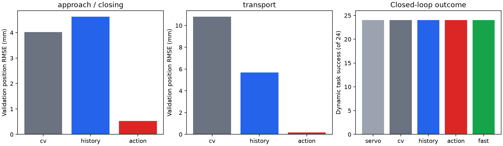
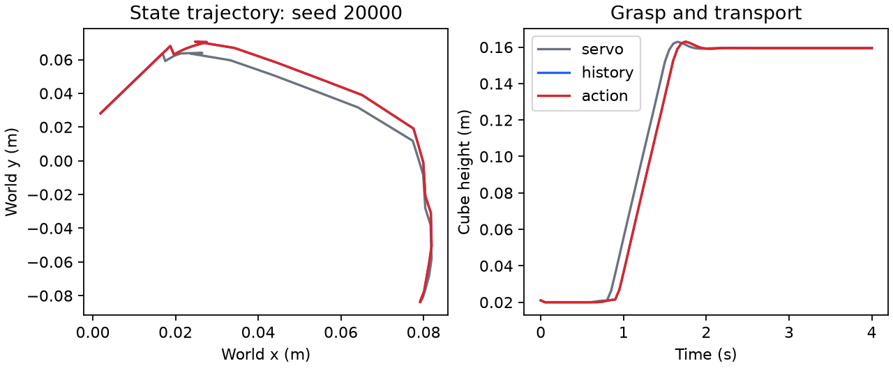

# Predictive Policy Adaptation

Updated: 2026-09-25

## Status and purpose

`feasibility_study`: 첫 CPU 관찰과 정책 prototype, 밀기·지연 관측, 접촉 과업 비교를
거쳐 [PushT 시연·정책 호환성](#pusht-demonstration-compatibility-2026-09-25)을 확인했다.
현재 다음 관찰은 [TODO](../../../../TODO.md)의 동일 접촉 상태 행동 대조다.
[Q16 question](../../questions/interaction-conditioned-motion.md)의 범위는 동적 환경에서의
정책 적응이다. 아래 첫 관찰은 당시 다른 GPU workload의 높은 사용률을 확인해 CPU PhysX와
작은 CPU model로 진행했다. Workspace image `research3-q16-motion:v1`은 public pinned
Python base에서 빌드했다. 기존 host simulator/image나 타 작업 container를 사용·변경하지 않았다.

## Planned observation

Panda가 dynamic cube를 잡아 지정된 공중 목표로 운반한다. Static과 sliding initial velocity를
비교하며 접촉 이후 pose를 강제로 덮어쓰지 않는다. 첫 task의 마찰·속도·길이는 development에서
기본 grasp와 움직임을 확인한 뒤 기록한다. Development와 train/test episode seeds를 분리한다.
Policy 입력은 object pose/velocity history와 robot proprioception이다. GT contact/grasp는
진단·평가 전용이며 policy/model에 주지 않는다. Grasp/목표 판정은 raw state로 재검산한다.

비교는 현재 위치 feedback, constant-velocity prediction, history-only learned prediction,
action-conditioned residual prediction이다. Learned pair는 데이터, architecture 크기,
candidate action 집합과 planner cost를 공유한다. 빠른 재계획은 별도 비용 대조다.
첫 모델 시도까지 한 묶음으로 진행하고 generic external VLA 재현을 선행조건으로 두지 않는다.
성공과 접촉 후 실패, 예측 오차, 완료 시간, 연산 및 interaction 비용을 기록한다.

원안 상한은 train 500 episodes, 첫 evaluation 24 initial states × static/sliding이다.
이것은 exploratory budget이며 구현·development 결과에 따른 수정은 아래에 누적한다.
첫 구현·관찰 2 working days/GPU 8시간 이내 추정을 CPU 실행으로 바꿨다. CPU runtime은
작은 development에서 확인하며 장시간 job은 background로 실행한다.

## Runtime and recovery

Working directory: `/home/yoohyun/research3`.

```bash
python buildup/robotics/pilot_studies/q16-motion/job.py build
```

Host `job.py`는 standard-library Docker orchestration만 한다. Dataset/model/simulator import와
실행은 Docker 안에서만 한다. Build/run command, log/exit, source snapshot, image identity,
mount와 container inspection은 `runs/q16/motion/jobs/`가 보존한다. Runtime output은
`runs/q16/motion/<attempt>/`, 별도 runtime cache는 `runs/q16/motion/cache/`다.
Source는 ManiSkill `a4a4f9272ad64b1564035874b605ceb687b63ed8`이며 Dockerfile에서 copy한다.
CPU execution에 GPU 노출은 없고 `--cpus=4 --memory=8g`, method threads는 1로 제한한다.
Timestamp stdout/exit는 `logs/`에 둔다. 필요한 결과·로그·inspection을 보존하고 이번
생성 기록으로 소유권이 확인된 종료 container만 개별 정리한다.

## Development and revisions

- `dev1`: native `build_cube`가 render backend를 꺼도 RenderMaterial을 생성해 rendering
  device가 없다는 오류로 중단했다. 실험 결과가 아니다. Cube/goal을 collision-only actor로
  구성해 수정했고 실패 로그·source snapshot을 보존했다.
- `dev2`: seeds 901/902 × static/sliding × servo/CV의 8 episodes 모두 최종 sustained
  grasp-and-transport를 달성했다. Controller parameter를 성능 차이가 나도록 바꾸지 않았다.
- `train1`: 160 episodes 수집 완료(128 training + 32 validation); 모두 collector의 task 성공.
- 평가 전 close-phase timer를 완료된 control step 기준으로 명시했다. 기존 10 Hz 동작은
  그대로이고 20 Hz도 같은 6 control steps(0.30 s) 동안 닫도록 맞췄다. Cadence와 closing
  duration이 섞이는 것을 피한 수정이며 eval 결과를 보기 전 적용했다.
- `fit1/eval1/verify1/diagnosis1`: 두 model fit, 240 episodes, raw-state 검산과 사례 해석 완료.

## Observation configuration

Panda, PhysX CPU 200 Hz, control 20 Hz, episode 80 steps (4 s), cube half-side 0.02 m.
Fresh reset 후 공통 24-step 준비로 TCP를 `[-0.025, 0, 0.115]`에 보내고 t=0 직전에
cube 위치/속도를 한 번 설정한다. 시작 위치 xy는 ±0.035 m, z=0.021 m이며 sliding 속도는
0.10–0.18 m/s의 임의 평면 방향이다. Cube/table friction은 둘 다 0.01, native finger
friction은 유지한다. 접촉 후 pose/velocity override는 없다. Collision-only 환경이므로
camera rendering 결과가 아닌 raw state/trajectory 기반 관찰이다.

목표는 `[0.08, -0.08, 0.16]` m이다. 매 step `native Panda grasp AND goal distance ≤0.025 m`를
기록하고 **마지막 5 states 모두 성공**인 경우 episode success로 센다. Once-success도 별도
기록한다. Grasp는 양 finger force≥0.5 N, opening direction과 force angle≤85°인 native
predicate이며 raw contact force/direction으로 독립 재계산한다. 목표를 붙잡고 운반하는
constructed task로, release/place 또는 native PickCube score가 아니다.

- Development seeds: 901–902. Train seeds: 10000–10063, validation: 10064–10079.
  각 seed의 static/sliding을 함께 배정한다. 평가: 20000–20023 × static/sliding.
- Collection controller는 seed parity에 따라 servo/CV이며 xy action에 고정 RNG의 ±0.10
  normalized jitter를 준다(최대 ±0.01 m의 명령 변형). 160 episodes, 최대 6,400 decision rows다.
- 공통 phase controller는 approach/descend/close/transport를 관측 거리·TCP 높이·경과 시간으로
  전환한다. Grasp flag를 읽지 않는다. Transport는 관측 object-to-TCP offset을 이용하는
  공통 feedback이다. 첫 learned comparison은 approach부터 gripper closing 구간에만 적용된다.
- 기본 update는 10 Hz이며 같은 delta action을 20 Hz control에서 두 번 실행한다. `fast`는
  CV controller를 20 Hz로 갱신한다. 같은 physical duration, 다른 decision 비용으로 해석한다.
- Model은 41 state/history features + 4 action inputs, hidden 64×64 SiLU, 3D displacement
  residual이다. History-only는 action 네 입력을 모두 0으로 두어 parameter 수를 맞춘다.
  두 모델은 동일 input normalization 절차, 데이터, optimizer/seed, 100 epochs와
  episode-disjoint validation 선택을 쓴다. Free-motion CV에 residual을 더하며 ±0.05 m로
  공통 clipping한다. Model 하나의 fit seed는 16023이다.
- Learned planner는 공통 CV action 주변 xy offset 3×3 후보를 같은 비용으로 선택한다.
  Cost는 예측 TCP/object xy 거리와 명령 deviation penalty다. Learned pair에 동일하게
  적용한다. `servo`/`cv`는 직접 제어이므로 model effect는 특히 history/action pair로 읽는다.
  두 모델의 초기 weights와 mini-batch 순서는 같은 seed로 맞춘다.

## Commands and expected output

```bash
python buildup/robotics/pilot_studies/q16-motion/job.py develop dev2
python buildup/robotics/pilot_studies/q16-motion/job.py collect train1
python buildup/robotics/pilot_studies/q16-motion/job.py fit fit1 --data train1
python buildup/robotics/pilot_studies/q16-motion/job.py evaluate eval1 --models fit1
python buildup/robotics/pilot_studies/q16-motion/job.py verify verify1 --data train1 --models fit1
python buildup/robotics/pilot_studies/q16-motion/job.py diagnose diagnosis1
```

Commands는 앞 stage 성공과 필요한 output 확인 후 순서대로 실행한다. 이미 사용한 output
attempt를 덮어쓰지 않는다. Expected: train1의 160 NPZ/JSON pairs와 collection/runtime/lock,
fit1의 history/action checkpoints 및 fit.json, eval1의 240 NPZ/JSON pairs와 episodes/runtime,
verify1의 독립 predicate/label/feature/split 검사와 compact results.
실행 job identity는 timestamp JSON이 소유하며 stdout/exit는 그 record의 log 경로를 따른다.


## Results 2026-09-23

**확인 사실:** 첫 task에서 다섯 route 모두 static 24/24, sliding 24/24 성공했고 grasp 후
release는 0회였다. Learned predictor의 정확도 차이는 closed-loop 성공 차이로 이어지지 않았다.
Compact source는 [summary.json](summary.json), [episode table](episodes.csv),
[case diagnosis](diagnosis.json)다. 이것은 single-task exploratory result이며 paper benchmark가 아니다.

| Controller | Static success | Sliding success | Sliding first-success time, mean | Mean controller decision latency, sliding |
| --- | ---: | ---: | ---: | ---: |
| Current-position servo, 10 Hz | 24/24 | 24/24 | 1.738 s | 0.050 ms |
| Constant-velocity, 10 Hz | 24/24 | 24/24 | 1.608 s | 0.049 ms |
| History-only learned prediction, 10 Hz | 24/24 | 24/24 | 1.604 s | 0.080 ms |
| Action-conditioned prediction, 10 Hz | 24/24 | 24/24 | 1.615 s | 0.077 ms |
| Constant-velocity, 20 Hz | 24/24 | 24/24 | 1.521 s | 0.043 ms |

Time은 raw state에서 처음 grasp+goal을 만족한 simulated time이며 실제 실행 시간과 다르다.
모든 episode는 4 s 동안 계속 실행했다. Latency는 controller 함수만 재며 physics, state
취득, vision을 포함하지 않는다. Fast는 80 decisions, 나머지는 40 decisions다.
단일 CPU/작은 model 측정이며 real-time VLA 성능으로 해석하지 않는다.

Validation 32 episodes의 0.1 s displacement prediction은 다음과 같다.

| Prediction model | Approach/closing RMSE (281 rows) | Transport RMSE (999 rows) | All rows |
| --- | ---: | ---: | ---: |
| Constant velocity | 4.029 mm | 10.822 mm | 9.745 mm |
| History-only MLP | 4.634 mm | 5.694 mm | 5.479 mm |
| Action-conditioned MLP | 0.527 mm | 0.178 mm | 0.293 mm |

두 MLP는 각각 7,299 parameters, 동일 5,120 training rows와 1,280 validation rows를 썼다.
Best epoch는 history 97/action 99이며 validation으로 선택했다. 따라서 이 RMSE는 model
selection에 사용한 validation 성능이지 독립 test prediction 결과가 아니다. 큰 transport
이점은 model이 transport 제어에 사용되지 않으므로 closed-loop 개선 근거로 옮길 수 없다.



## Case interpretation and limits

- Sliding CV의 첫 관측 finger contact 직전 속도 median은 0.085 m/s, 그때까지 평면 이동
  거리 median은 58.6 mm다. 단순히 모든 물체가 멈춘 뒤 잡은 비교는 아니다.
- 두 learned route에서 각각 72개의 model decision window에 관측 finger contact가 있었다.
  History/action의 선택 후보 histogram과 실제 action이 다르며, paired cube trajectory RMS
  차이는 0–8.61 mm였다. Model이 실행되지 않아 결과가 같았던 경우로만 설명되지 않는다.
- `first_contact_*`와 contact-window는 **control-rate로 저장한 양 finger force 중 하나가
  0.05 N를 넘은 표본**이다. 모든 robot link의 최초 접촉 또는 physics-substep event time이
  아니다. 더 이른 palm contact 등을 제외했다고 주장하지 않는다.
- 그림은 미리 고른 evaluation 첫 seed 20000의 raw-state trajectory다. State animation은
  [ignored output](../../../../runs/q16/motion/diagnosis1/state.gif)에 있으며 camera video가 아니다.
  Geometry/grasp label의 근거는 raw pose/force이며 animation 자체를 성공 판정으로 쓰지 않는다.



**에이전트 해석:** 이 full-state, 단일 cube, 넉넉한 4 s 제어 조건에서는 단순 feedback와
phase switching으로 충분했다. 예측 정확도만으로 action-conditioned model의 필요성을
정당화할 수 없다. 24개 paired initial states의 포화된 성공이 모든 dynamic manipulation에서
모델이 불필요하다는 증거는 아니다. Data-efficiency curve, vision 오차, 다양한 shape/dynamics,
external policy와 model seed 반복은 아직 다루지 않았다.

**첫 관찰 직후 판단:** Q16을 `under_review / refine`으로 두었다. 같은 성공 grid를 확대하지 않고,
접촉 뒤 가능한 행동 중 선택을 바꾸는 구체적 상황과 필요한 예측 horizon을 선행/이번
trace에 대조하기로 했다. 이후 사용자 의견과 직접 선행 검토를 반영한 현재 결정은
[방법 개발 계속](#method-development-2026-09-23)이다. 첫 결과와 성공 기준은 바꾸지 않았다.
Formal hypothesis/paper 승격은 없다.

## Verification, preservation and cleanup

[Verifier](verify.py)는 train/eval **400 episodes, 32,400 raw states, 17,920 decision rows**의
force/direction 기반 grasp, 목표 거리/5-state success, release, 초기 위치·속도, 허용된
feature, action hold/미래 displacement, finite values와 split을 검사했다. Evaluation의
48개 paired initial conditions도 tolerance 1e-7에서 일치했다. Runtime source와 모든 실패
snapshot은 job record에 보존했다. 초기에 성공한 8 development episodes는 이 400회 검산
분모에 포함하지 않는다.

[Runtime identity](runtime.json), [Python lock](installed.lock), [OS package lock](os-packages.lock),
Dockerfile/requirements와 원본 job command를 보존한다. Image ID는
`sha256:72073ab3d95dc63ab261bb79084a894cac7a250c15fb27859a42cbc84c5bf026`이다.
Tag는 `research3-q16-motion:v1`; CPU/graphics-free runtime이다.

`runs/q16/motion/preservation.json`에 918개 파일의 bytes/SHA256을 기록한 뒤
[cleanup.py](cleanup.py)로 이번 생성 기록·labels·mount·image가 확인된 종료 container 7개만
삭제했다. [Cleanup log](../../../../logs/20260923_105434_q16_cleanup.log)에 ID가 있다.
다른 container, image, dataset, cache는 삭제하지 않았다. 외부 backup은 미검증이다.

결과 보존에는 compact results와 raw traces가, 분석 재실행에는 위 output·recipe가,
전체 재현에는 pinned source·Docker dependencies와 모든 commands가 필요하다.
Source/model/NPZ는 ignored runtime 경로에 있어 Git만으로 전체 결과를 복구할 수 없다.

## Method Development 2026-09-23

**결정:** Q16을 계속 진행한다. 개발 목표는 **물체 운동과 접촉 조건이 달라져도 학습된 조작
정책을 재사용하도록, 미래 궤적 예측과 실행 피드백으로 행동 묶음을 보정하는 것**이다.
시의성과 중요한 capability를 근거로 초기 방법 개발에 투자한다. 작은 cube에서 성공률
차이가 없었다는 이유로 질문을 잔여 실패 하나에 한정하지 않는다.
[직접 선행·구현 비교](../../related_work/policy-geometry.md#q16-policy-adaptation-direction-2026-09-23)가
이 선택의 근거다. 아래는 개발 계획이며 새 성능 결과나 실행 중인 job이 아니다.

### What Changes From The First Implementation

첫 구현은 0.1 s 뒤 단일 displacement를 예측하고, 규칙 controller의 xy 후보 9개 중 하나를
선택했다. Z/gripper/phase 전환과 transport는 공통 규칙이 담당했다. 따라서 learned policy의
행동 묶음 전체를 보정하거나 수 단계 뒤 접촉 결과를 비교한 실험이 아니다. 예측 RMSE와
성공률의 불일치를 보존하면서, 다음 구현에서는 정책·예측·실행을 실제로 연결한다.

| 구성 | 첫 개발 형태 | 이 형태로 배우려는 것 |
| --- | --- | --- |
| Base policy | Nominal demonstrations로 학습한 작은 state-based Diffusion Policy. Adaptation 비교에서는 policy weights를 고정한다. | 학습된 행동을 재사용할 때 생기는 실행 오차와 correction의 역할 |
| Dynamics model | 최근 object/robot state와 실제 action 이력, candidate action sequence를 받아 여러 step의 object/robot state를 예측하는 작은 model | 단일 displacement보다 긴 예측이 행동 선택에 어떤 정보를 주는가 |
| Predictive correction | Policy chunk 주변의 행동 sequence를 비교해 예측 task progress, 원래 행동과의 차이, 시간적 일관성을 함께 고려한다. XYZ와 gripper를 포함한다. | 정책의 유용한 행동을 유지하면서 필요한 부분을 수정할 수 있는가 |
| Execution feedback | 짧은 prefix 실행 후 관측과 예측 차이를 context에 반영해 다시 예측·보정한다. 첫 형태는 online weight update 없이 진행한다. | 고정된 dynamics model과 관측에 따라 context가 변하는 model의 차이 |

첫 action/prediction horizon은 control 20 Hz의 8 steps (0.4 s), 실행 prefix는 2 steps로
시작하는 설계값이다. 최적값이라는 근거는 없다. Policy 학습 안정성과 접촉 사례를 보며
수정 이유를 기록한다. 접촉/성공 flag와 미래 state를 policy/context 입력으로 주지 않는다.
Gripper와 행동 전환을 평가 중 privileged phase controller가 대신 결정하게 하지 않는다.
Demonstration 수집용 teacher와 단순 규칙 baseline은 이 제한과 구분한다.

MPC, action conditioning, residual correction, feedback context는 기존 원리다.
그 조합 자체를 novelty로 쓰지 않는다. 기여의 구체적 형태는 정책이 실패하는 조건,
단순 보정으로 충분한 조건, 데이터·계산 비용과 대표 과업의 반복 개발에서 찾아간다.

### Tasks, Data And Comparisons

1. **Grasp-and-transport:** 기존 constructed task에서 learned policy와 sequence dynamics를
   연결한다. 첫 관찰의 성공 판정은 유지하고, nominal training 이후 물체 초기 운동과
   접촉 물성 변화에서 행동을 읽는다. 기존 low-friction 설정의 범위도 명시한다.
2. **Pushing:** 위 구현을 pinned ManiSkill `PushCube-v1`에 연결해 지속적인 접촉과 목표 도달을
   다룬다. 새 task가 방법을 발전시키는 자료가 되도록 하며, 첫 task에서 양의 효과를 보일
   때만 허용하는 gate로 두지 않는다. Native goal radius 0.1 m를 출발점으로 유지한다.
3. **후속 확장:** Shape variation과 visual pose/point-cloud 입력은 앞의 제어·학습 양상이
   확인된 뒤 추가한다. 첫 주에 모두 요구하지 않으며 state-based 결과를 vision/VLA
   generalization으로 해석하지 않는다.

Nominal demonstration은 task당 약 100–200 episodes부터 시작한다. 기존 `train1`은 수집기와
입출력 점검에 재사용할 수 있지만, sequence target은 raw trace의 **실제 연속 action**과
미래 state로 구성해야 한다. 기존 단일 action을 복제해 미래 행동 label로 쓰지 않는다.
Push task와 추가 dynamics interaction은 새로 수집하고 성공·실패 episode를 함께 보존한다.
Train/validation/development/evaluation은 episode 단위로 나누며 기존 `eval1`은 이미 본
탐색 자료다. 후속 평가에는 새 초기 상태를 쓰고, task/물성 범위·seed·비용을 실행 전에
기록한다. 모델 수정에 사용한 평가를 나중에 독립 확증 결과로 부르지 않는다.

대표 조건은 nominal, initial object motion, friction/mass 변화부터 단계적으로 정한다.
물리적으로 의미 있는 변화 범위를 쓰고 성능 차이가 생길 때까지 noise·성공 기준을
조절하지 않는다. 처음부터 full Cartesian grid나 모든 모델의 대규모 재현을 요구하지 않는다.

초기 비교는 frozen policy, 더 짧은 실행 chunk로 재계획하는 policy, 단순 geometric/
constant-velocity feedback, 고정 context의 predictive correction, feedback context를 쓰는
predictive correction이다. 순서대로 구현하되 실제 observation/action/compute 비용을
함께 기록한다. 새 dynamics 데이터를 추가했다면 base demonstration 수와 구분하고,
data-efficiency를 주장하기 전 같은 추가 데이터의 policy fine-tuning과도 비교한다.
DynaGuide와 Feedback World Model은 외부 비교 후보이며 full reproduction을 첫 구현의
선행조건으로 두지 않는다.

Task success 외에 final goal error, completion time, grasp loss/contact trajectory,
action correction 크기, prediction error, interaction 수와 실제 latency를 함께 읽는다.
성공률이 포화돼도 연속 오차와 실행 사례로 무엇을 배웠는지 기록한다. 예측 오차만의
개선을 행동 성공이나 학습 효율 개선으로 옮겨 쓰지 않는다.

### Allocation, Implementation And Next Deliverable

초기 개발 묶음은 **약 5 working days, 단일 GPU 최대 20시간**을 계획 상한으로 잡는다.
현재 GPU 여유와 새 dependency compatibility를 확인한 실행 시간 보장이 아니다.
먼저 작은 학습/실행에서 시간을 재고, 대표 조건당 32개 paired 초기 상태 수준으로
사례를 살펴본다. 예산 종료는 자동 보류 gate가 아니다. 구현 가능성, 학습한 내용과 남은
비용을 보고 다음 범위를 조정한다. 새 benchmark 통과나 즉각적인 유의한 성공률 차이를
이 개발 기간의 필수 산출물로 요구하지 않는다.

**다음 TODO의 산출물:** 새 Docker recipe/lock과 isolated output 경로를 준비하고,
grasp-and-transport에서 demonstration → learned action chunk → multi-step prediction →
feedback correction을 연결한 첫 prototype을 구현·실행·해석한다. Pushing 연결은 그 다음
작업으로 둔다. Official ManiSkill diffusion-policy example은 source reference이며,
현재 Q16 CPU image에 해당 학습 dependency가 준비됐다는 뜻은 아니다.

후속 runtime은 `runs/q16/adaptation/` 아래에 별도 구성한다. 첫 `runs/q16/motion/` 결과는
덮어쓰지 않는다. 실제 구현의 recipe, dependency/source, CPU/GPU, split/seed, mount,
background command/log/exit, 예상 output과 verification은 아래에 기록한다.
완료 또는 실패한 container는 결과·로그 보존과 workspace 소유권 확인 후 필요한 것만
개별 정리한다. Host method 실행이나 타 작업 자산 사용으로 우회하지 않는다.

## First Adaptation Prototype 2026-09-23

**진행 상태:** 첫 정책 적응 prototype의 수집·학습·두 번의 개발 평가·32개 새 초기 상태 반복·
독립 raw-state 검산·결과 보존을 완료했다. 현재 결과와 다음 과업은
[반복 결과](#adaptation-results-2026-09-23)를 따른다. 아래 첫 설정은 당시 기록이며
수정·결과는 이 절 끝에 누적한다.
[Dockerfile.adaptation](Dockerfile.adaptation), [adaptation.py](adaptation.py),
[diffusion.py](diffusion.py), [dynamics.py](dynamics.py)와
[adaptation_job.py](adaptation_job.py)를 추가했다. `adaptation_job.py`는 host standard library로
Docker만 orchestration한다. Simulator와 ML dependency import·실행은 container 내부다.

첫 prototype의 policy는 state-conditioned 16-step denoising으로 8-step 실제 action chunk를
생성하는 작은 MLP다. 공식 ManiSkill Diffusion Policy checkpoint/architecture의 재현으로
표기하지 않는다. Policy 학습에는 nominal static teacher demonstration 128 episodes,
validation에는 32 episodes를 사용한다. Dynamics는 그 자료에 moving teacher 48 training +
16 validation episodes를 더해, 실제 연속 action 8개와 관측 history로 물체/TCP의 8-step
trajectory를 예측한다. Teacher의 phase는 학습 입력에 넣지 않고 시연 생성·진단에만 쓴다.
Policy weight는 평가에서 고정한다.

평가 route는 10 Hz 규칙 CV feedback, learned policy의 2-step 실행, 같은 policy의 1-step
재계획, 예측만 사용하는 chunk correction, 실행 후 object prediction error를 반영하는
correction이다. 마지막 두 route는 동일한 checkpoint와 후보 chunk·계산 구조를 쓰며,
후자는 직전 2-step의 실제-예측 오차를 다음 예측에 반영한다. 각 route는 같은 seed/condition에서
fresh reset과 24-step 초기 준비를 거친다. Success는 첫 관찰과 같은 마지막 5-step
grasp+goal criterion이다. 평가 중에는 규칙 phase controller가 학습 route를 제어하지 않는다.

평가 조건은 static friction 0.01, moving friction 0.01, moving friction 0.05의 세 조건이다.
처음 8개 paired seeds는 **개발 관찰**이고, 후속 method 변경에 사용하면 독립 확증 split으로
재사용하지 않는다. Mass·shape와 vision은 이번 묶음에 추가하지 않았다. 첫 평가의 목표는
정책 학습과 계획 보정이 실제 task에서 작동하는지와 실패 형태·비용을 보는 것이다.
양의 성능 차이와 최적 horizon은 아직 확정하지 않는다.

Build의 image tag는 `research3-q16-adaptation:v1`이고 base는 pinned public Python
3.11 slim digest다. Pinned ManiSkill source는
`a4a4f9272ad64b1564035874b605ceb687b63ed8`; CPU PyTorch 2.7.1,
`requirements.lock` 및 image 내부 `installed.lock`·`os-packages.lock`을 사용한다.
CPU PhysX 200 Hz/control 20 Hz, 6 CPU/12 GiB container 제한, GPU 노출 없음.
Workspace-owned source snapshot은 read-only `/study`, runtime은 `/output`, 별도 cache는
`/home/research`로 mount한다. 이름·label·image ID와 mount는 `jobs/*.json`에 남긴다.

Working directory: `/home/yoohyun/research3`. Background launcher의 정확한 명령은 다음과 같다.

```bash
python buildup/robotics/pilot_studies/q16-motion/adaptation_job.py build build1
python buildup/robotics/pilot_studies/q16-motion/adaptation_job.py collect collect1
python buildup/robotics/pilot_studies/q16-motion/adaptation_job.py fit fit1 --data collect1
python buildup/robotics/pilot_studies/q16-motion/adaptation_job.py evaluate eval1 --models fit1
python buildup/robotics/pilot_studies/q16-motion/adaptation_job.py verify verify1 --data collect1 --models fit1 --evaluation eval1
python buildup/robotics/pilot_studies/q16-motion/adaptation_job.py diagnose diagnosis1 --data collect1 --evaluation eval1
```

각 stage는 앞 결과 확인 후 독립 job으로 실행한다. Launcher는 사용한 attempt가 비어 있지 않으면
덮어쓰기를 거부한다. Timestamp stdout/exit는 `logs/*_q16_adaptation_*.log/.exit`, exact command,
source hash, Docker inspection은 `runs/q16/adaptation/jobs/`에 기록한다. Expected output은
`collect1`의 224개 NPZ/JSON trace와 `collection.json`, `fit1`의 policy/world checkpoints와
`fit.json`, `eval1`의 120개 NPZ/JSON trace와 `episodes.json`, `verify1`의 독립 raw-state
검사·group/paired 결과·episode CSV다. Train/validation/evaluation seed 구간은 각각
30000–30159 및 31000–31063, 32000–32007이며 실제 세부 split은 collection record가 소유한다.
Build log는 `logs/20260923_112316_922896_q16_adaptation_build.log`, job identity는
`runs/q16/adaptation/jobs/20260923_112316_922896_build.json`이다.

### First Evaluation And Policy Revision

`collect1`에서 160 static + 64 moving teacher episodes의 최종 5-step 성공을 확인했다.
`fit1`의 128 static training/32 validation policy는 9,344/2,336개의 실제 action-window를
사용했다. World model은 static 128+moving 48 training과 static 32+moving 16 validation의
12,848/3,504 windows를 사용했다. World의 validation 8-step object/TCP trajectory RMSE는
0.640/0.561 mm였지만 teacher action 분포에서 측정한 값이다.

첫 `eval1`은 seed 32000–32007 × 세 조건 × 다섯 route의 120회 탐색 비교다.
[독립 raw-state 검산](../../../../runs/q16/adaptation/verify1/summary.json)은 120 trace,
9,720 states와 24개 route-paired initial conditions에서 force/direction grasp,
goal+마지막 5-step 성공, split/checkpoint/file identity를 통과했다. CV는 각 조건 8/8,
learned policy와 두 correction은 모두 0/8 성공이었다. 현재 보정의 우월성이나
동역학 적응 효과를 주장할 근거가 없다.

[사례 진단](../../../../runs/q16/adaptation/diagnosis1/diagnosis.json)에서 첫 static seed의
teacher/CV는 초기 12 actions의 gripper close 비율이 2/12였으나, 생성 policy는 9/12였다.
Policy의 TCP-object 최소 거리는 0.070 m이고 grasp가 없었다. 이는 행동 생성·실행 문제가
우선임을 보여준다. 짧은 sequence의 작은 validation prediction RMSE를 counterfactual
candidate나 closed-loop 안정성으로 옮길 수 없다는 경계도 확인했다.

**탐색 수정:** `fit2`부터 같은 nominal 시연과 split에 supervised action-chunk head를
추가했다. Denoising loss와 시연 행동 회귀를 함께 학습하고, 실행에서는 예측 행동의
75%와 생성 행동의 25%를 섞는다. Gripper action은 행동 회귀의 부호를 따라 open/close로
내보낸다. 별도 `anchor` route는 회귀 head만 쓰므로 그 비용과 효과를 구분한다.
이 선택은 `eval1` 실패를 본 뒤 이루어진 수정이다. `eval2`는 새 seeds 32008–32015와
CV/anchor/policy2/policy1/fixed/feedback 여섯 route를 사용하며, 개발 결과다.
첫 `fit1/eval1/verify1/diagnosis1`의 source·출력은 덮어쓰지 않는다.

`eval2`의 8 paired seeds에서 static은 모든 route 8/8이었다. Moving은 CV/anchor/policy2/
policy1/fixed/feedback 순서로 8/3/2/2/7/6 of 8, friction은 8/8/8/7/8/8 of 8이었다.
Force/direction과 마지막 5-step success를 144 traces·11,664 states에서 다시 계산했고
24개 condition별 초기 state pairing을 확인했다. 직접 근거는
[verify2](../../../../runs/q16/adaptation/verify2/summary.json)와
[diagnosis2](../../../../runs/q16/adaptation/diagnosis2/diagnosis.json)다.
Moving에서 예측 보정은 학습 정책 단독보다 좋아졌으나, 단순 CV보다 낫지 않다.
Execution-error bias는 fixed correction보다 한 사례 악화했다. 이 결과는 model 자체의
일반적 우위 또는 feedback mechanism의 필요성을 확증하지 않는다.

작은 분모의 변동을 확인하기 위해 **fit2와 모든 정책·보정 파라미터, 세 조건,
success criterion을 고정**하고 새 seeds 32016–32047의 32 paired initial conditions를
반복한다. 이것은 방법 수정 뒤의 새 exploratory repetition이며 paper-level 독립 확증은 아니다.
예상 32 × 3 conditions × 6 routes = 576 episodes; 새 output `eval3/verify3`를 쓴다.

```bash
python buildup/robotics/pilot_studies/q16-motion/adaptation_job.py evaluate eval3 --models fit2 --seed-start 32016 --seed-count 32
python buildup/robotics/pilot_studies/q16-motion/adaptation_job.py verify verify3 --data collect1 --models fit2 --evaluation eval3
```

### Adaptation Results 2026-09-23

`fit2`는 static demonstration 128 training + 32 validation으로 policy를 학습했다.
동역학 모델에는 별도 moving demonstration **48 training + 16 validation**을 추가했다.
따라서 이 방법과 nominal policy의 moving 성능 차이를 동일 데이터 예산의 순수 model 효과나
data efficiency로 부르지 않는다. Policy는 199,744 parameters, world model은 107,056이다.
Teacher trajectory validation에서 world object/TCP 8-step RMSE는 0.640/0.561 mm다.
별도 행동 후보에서의 예측 정확도를 이 값으로 대변할 수 없다.

`eval3`은 `fit2` checkpoint와 보정 파라미터를 유지한 채 새 seeds 32016–32047에서
576회를 실행했다. [검산 요약](adaptation_summary.json)과
[episode table](adaptation_episodes.csv)는 46,656 raw states, 96개 condition별 paired
initial states, force/direction grasp, 마지막 5-step success, split/checkpoint/trace
identity의 독립 재계산 결과를 보존한다.

| 조건 | CV feedback | Supervised chunk | Diffusion policy | Fast replanning | Predictive correction | Feedback-adjusted correction |
| --- | ---: | ---: | ---: | ---: | ---: | ---: |
| Static, friction 0.01 | 32/32 | 32/32 | 32/32 | 32/32 | 32/32 | 32/32 |
| Moving, friction 0.01 | 32/32 | 8/32 | 9/32 | 9/32 | **32/32** | 29/32 |
| Moving, friction 0.05 | 32/32 | 31/32 | 31/32 | 29/32 | 32/32 | 32/32 |

여기서 Diffusion policy는 `fit2`의 supervised action head 75%와 denoising sample 25%를
합친 구현이다. Supervised chunk 열은 action head만 사용한다.

Moving 조건에서 예측 보정은 동일한 `fit2` diffusion policy의 9/32에서 32/32로
올랐다. Policy 실패 23개를 모두 회복했고 성공 9개를 잃지 않았다. 단순 CV feedback도
32/32이며 controller decision latency는 CV 평균 약 0.05 ms, diffusion policy 약 1.02 ms,
predictive correction 약 1.22 ms다. 이 latency는 action 결정 함수만 재며 physics·관측
획득은 제외한다. 계산·데이터 비용까지 고려하면 현재 task에서 모델의 우월성은 없다.

Moving에서 기본 diffusion policy는 18/32만 한 번이라도 grasp했고 최종 성공은 9/32였다.
예측 보정은 32/32 grasp 및 최종 성공이다. Feedback-adjusted route는 32/32 grasp했지만
29/32만 끝까지 성공했으며 fixed correction보다 3개 사례가 악화됐다. 직전 예측 오차를
더한 방식의 필요성은 지지되지 않는다. Correction 크기는 moving에서 fixed 평균 0.107,
feedback-adjusted 평균 0.203으로, 단순 residual 추가가 과도할 가능성은 **진단 가설**이다.
그 원인을 분리한 ablation은 아직 없다.

[첫 실패](adaptation_first.json)와 [수정 후 8-seed 결과](adaptation_revision.json)를
별도로 보존한다. 처음 정책은 그리퍼를 일찍 닫아 모든 learned route가 0/8이었고,
`fit2`는 이를 본 뒤 supervised 행동 head와 open/close 출력을 추가했다. 32-seed 반복은
새 초기 상태에서 같은 수정 방법을 확인했지만, 전체 연구에서 독립된 paper-level
확증이나 여러 task의 generality evidence는 아니다. 이 실험은 정확한 state·단일 cube·
작은 constructed grasp task다. 공식 ManiSkill benchmark score나 VLA/vision/real-robot
성능으로 보고하지 않는다.

**다음 개발:** 지속 접촉이 중요한 pinned `PushCube-v1`에서 같은 정책 적응 구조를 구현하고
native 0.1 m goal criterion, 단순 제어, 동일 추가 dynamics data로 policy를 갱신하는
대조를 함께 둔다. 첫 grasp task의 CV 성공 포화와 추가 moving data 사용을 직접 다뤄야
model-guided correction의 실제 가치가 분명해진다. 별도 과업의 양의 결과를 미리 가정하지 않는다.

Image `research3-q16-adaptation:v1`의 ID는
`sha256:a8d5594837e8a9f1d7accaf92490b8d015173ce319946d5370d2b1131ede1421`이다.
`runs/q16/adaptation/`의 2,275개 local source/output/log 파일을
`preservation.json`에 bytes/SHA256으로 기록한 뒤, 생성 record·label·mount·image·종료
상태를 확인한 이 작업의 container 11개만 삭제했다.
[Cleanup log](../../../../logs/20260923_113611_q16_adaptation_cleanup.log)를 보존했다.
Image, 결과, model, dataset, cache와 타 작업 container는 삭제하지 않았다.
Raw output과 model checkpoint의 외부 backup은 검증하지 않았으므로 Git의 compact 결과만으로
전체 분석이나 재현을 대신할 수 없다.

## PushCube Extension 2026-09-23

**Status:** isolated CPU Docker implementation and two exploratory evaluations completed. This is a buildup feasibility study, not a paper result. Pinned ManiSkill source is `a4a4f9272ad64b1564035874b605ceb687b63ed8`; the `PushCube-v1` subclass removes visual actors for renderer-free CPU operation but retains native reset, goal radius 0.1 m, 50-step limit, control, and `evaluate()` success. This construction must be reported as a collision-only variant, not unmodified RGB PushCube. Smoke1 found phase oscillation (0/8); smoke2 held the phase but sometimes switched while TCP was high (6/8); smoke3 requires low TCP height before switching (8/8). All three development sets use the same eight seeds and are retained; none are confirmation evidence.

The observation is object pose/velocity, TCP pose, robot joints, and goal position (current and previous). It excludes native success/contact labels. A geometric feedback teacher supplies 96 nominal training and 24 validation episodes at friction 0.4. The **same** 32 additional low-friction training and 8 validation episodes enter the world model and the updated-policy control; the frozen policy receives nominal demonstrations only. All three models use actual executed action sequences. No grasp checkpoint is transferred. First smoke seeds are 43000–43007; independent evaluation starts 42000, with 16 paired seeds, nominal and low-friction conditions, and six routes: geometric feedback, frozen policy, one-step replanning, equal-extra-data updated policy, fixed predictive correction, and residual-feedback predictive correction. Development feedback may lead to a revised run; any such seeds cease to be held out.

The Docker recipe is [Dockerfile.push](Dockerfile.push), pinned package record [requirements.lock](requirements.lock), source [push_task.py](push_task.py), [push.py](push.py), [diffusion.py](diffusion.py), [dynamics.py](dynamics.py), and host stdlib-only [push_job.py](push_job.py). Build starts from pinned public Python image, not any preexisting research image. Job source snapshots, exact image ID, command, mounts, CPU device, logs, exit status, and Docker inspection are under `runs/q16/push/jobs/`; ignored raw traces and checkpoints remain under `runs/q16/push/`. All workload execution occurs in Docker. From repository root, execute each later command only after the previous stage completes and its output is verified:

```bash
python buildup/robotics/pilot_studies/q16-motion/push_job.py build build1
python buildup/robotics/pilot_studies/q16-motion/push_job.py smoke smoke3
python buildup/robotics/pilot_studies/q16-motion/push_job.py collect collect1
python buildup/robotics/pilot_studies/q16-motion/push_job.py fit fit1 --data collect1
python buildup/robotics/pilot_studies/q16-motion/push_job.py evaluate eval1 --models fit1 --seed-start 42000 --seed-count 16
python buildup/robotics/pilot_studies/q16-motion/push_job.py verify verify1 --data collect1 --models fit1 --evaluation eval1
```

Logs are timestamped `logs/*_q16_push_*.log` with `.exit` receipts. Expected: 8 smoke traces; 160 teacher NPZ/JSON traces and `collection.json`; frozen/updated policy checkpoints and a world checkpoint; 192 paired evaluation traces and `episodes.json`; independently computed native-label, checksum, shape and count validation in `verification.json` and compact `episodes.csv`. Criteria: final native success, XY goal error, cube progress, first success time, decision latency, and prediction residual. No data-efficiency or generalization claim follows from this one state-based task. The image has no external verified backup; deleting it after completion preserves bind-mounted results but loses immediate rerun and exact image identity.

### First pushing comparison and revision

The first independent seeds 42000–42015 (`eval1`/`verify1`) yielded 192 paired episodes and 9,792 raw states; all 352 teacher/evaluation checksums and native success labels passed. Nominal successes out of 16 were feedback 16, frozen 11, one-step replan 6, updated policy 12, fixed prediction 1, residual feedback prediction 0. Low-friction counts were 16, 11, 6, 13, 3, 4 respectively. Mean final XY goal error in nominal was 0.0456 m for feedback, 0.0793 m frozen, 0.0726 m updated, and 0.1735 m fixed prediction; low-friction values were 0.0105, 0.0692, 0.0560, and 0.1270 m. These counts are exploratory after smoke/controller adjustment; they do not support a positive prediction-correction claim.

The world validation object-position RMSE was 0.00397 m on held-out teacher windows, but the corrective planner selected the positive x-action offset in 279/400 nominal and 248/400 low-friction decisions. Its average correction norm was about 0.21 action units per chunk, while actual cube progress fell from 0.122 m (frozen nominal) to 0.030 m (corrected nominal). This is consistent with short-horizon teacher-trajectory prediction being insufficient to select unconstrained corrective actions. It does not by itself establish a causal mechanism; contact loss and candidate extrapolation require case-level checks. A method revision now restricts correction to observed TCP-behind-cube proximity at low height and halves offset size; it uses no contact oracle. Since the first evaluation informed this change, new seeds 42016–42031 are a fresh comparison and `eval1` must not be relabeled as held-out evidence for the revision.

```bash
python buildup/robotics/pilot_studies/q16-motion/push_job.py evaluate eval2 --models fit1 --seed-start 42016 --seed-count 16
python buildup/robotics/pilot_studies/q16-motion/push_job.py verify verify2 --data collect1 --models fit1 --evaluation eval2
```

The revised run adds `contact_gated` and `contact_gated_feedback` to the original six routes, retaining their checkpoints and environment settings. It is expected to produce 256 paired evaluation traces. Interpretation should compare them to frozen/updated policy and geometric feedback at the same new seeds, report remaining failures and runtime cost, then decide whether broader observations or feedback-context changes are worthwhile.

### Revised result, interpretation, and preservation

**Completed.** `eval2`/`verify2` on unseen seeds 42016–42031 produced 256 episodes and 13,056 raw states; 416 checksums including teacher traces, shape, paired-seed counts and native success labels passed. Combined with `eval1`, this study evaluated 448 episodes and recorded 22,848 evaluation states. The initial smoke seeds and first evaluation informed implementation changes; no result here is a frozen paper-level test. [Compact summary](push_summary.json) and [episode table](push_episodes.csv) contain both splits and every route. `push_summarize.py` is a host standard-library-only metadata reduction, not a simulator or model execution.

| New seeds, native final success | Feedback | Frozen policy | Equal-data updated policy | Original prediction | Contact-gated prediction | Contact-gated + residual |
| --- | ---: | ---: | ---: | ---: | ---: | ---: |
| Nominal, 16 | 16 | 13 | 13 | 4 | 6 | 5 |
| Low friction, 16 | 16 | 13 | 13 | 2 | 6 | 9 |

The original residual-feedback route reached 3/16 nominal and 2/16 low-friction; one-step policy replanning reached 7/16 in both. The new contact gate reduced correction size from about 0.21 to 0.08 action units, but it still selected positive x-offset in 209/277 nominal and 203/279 low-friction open-gate decisions. Compared on the *same* seeds, contact-gated prediction rescued 0 frozen-policy failures and harmed 7 successes in each condition. The residual version rescued 0/harmed 8 nominal and rescued 1/harmed 5 low-friction. Equal-extra-data policy retraining matched frozen successes exactly on the new split, even though `eval1` had modest rescue (1 nominal, 2 low-friction). Its validation loss is on a different data mix and is not a direct gain measure. Average decision latency on the new split was about 0.04 ms for simple feedback, 0.99 ms for frozen policy, and 1.12–1.16 ms for gated predictive routes in this CPU container; these are local implementation timings, not hardware latency claims.

**Agent inference:** a low held-out teacher-window prediction RMSE (0.00397 m for object position) did not make the action-candidate objective reliable. Contact gating alleviated but did not reverse damage. Off-demonstration actions, TCP contact geometry and long-horizon effects are possible explanations, not yet isolated causes. The tested simple observation-residual bias is not worth another parameter sweep on these full-state cube settings. Feedback succeeds 32/32 across both fresh push conditions, matching the earlier grasp result that simple feedback is strong. The next Q16 development should test a representative observation-imperfect or object-variation setting with the same inputs for simple feedback and learned alternatives, and explicitly check whether model-guided actions provide value beyond added data. Maintain a broad policy-adaptation question; no positive prediction, data-efficiency, visual generalization, or paper claim follows from this study.

Build image: `research3-q16-push:v1`, exact ID `sha256:24d557c58ecd8fc6d5fe050a2219412c42d0d0a5cad432c60f8761a15639b9b1`. Image internal `installed.lock` and `os-packages.lock` were copied to `runs/q16/push/fit1/`. Job records store source snapshots, hashes, exact commands, mount, CPU and image inspection; logs/exit receipts are timestamped. [Preservation manifest](../../../../runs/q16/push/preservation.json) records 1,380 files with bytes/SHA256, excluding disposable cache. `python buildup/robotics/pilot_studies/q16-motion/push_cleanup.py` verified result counts and preserved files, then individually removed only nine exited containers whose job record, workspace label, image ID and mounts matched. Cleanup log: `logs/20260923_115649_q16_push_cleanup.log`; no other container, image, volume or cache was removed. Raw traces/checkpoints/source snapshots in ignored `runs/q16/push/` have no verified external backup. Image removal would preserve these bind-mounted results, but exact image identity would require a verified export; recipe rebuild is not byte-identical proof.

## Delayed Object Observation 2026-09-23

**Scope before execution:** Test one representative observation-imperfect condition on the same collision-only native-goal `PushCube-v1` setup: object pose and velocity arrive four 20 Hz control steps (0.20 s) late, while robot proprioception and fixed goal remain current. This is a constructed sensor-latency condition, not a camera/VLA or real-world sensor result. A common deterministic delay buffer is reset for every paired episode. No route can access the current true object state for action selection; native success and raw true trajectories remain evaluation labels. We retain nominal friction 0.4 and low friction 0.05 as the two task conditions and 50-step native limit, without changing success threshold to create differences.

Compare delayed-pose geometric feedback, its constant-velocity extrapolation using only delayed object velocity, a nominal-demonstration action-chunk policy, the same policy architecture retrained with the **same** additional low-friction demonstrations supplied to the dynamics model, and a contact-gated world-model correction of the nominal policy. A clean-observation feedback route is a privileged reference only and is excluded from matched-information superiority claims. World-model supervision may use actual future object/TCP states in the recorded training demonstrations; its inference input is delayed observations and proposed actions, and its true-state prediction residual is evaluated offline only. Policy inputs remain delayed observations. For all learned routes, the nominal split is 96 training/24 validation episodes; the extra split is 32 training/8 validation episodes. Demonstrations are generated by the same delayed-velocity feedback controller that is an evaluation baseline, with a small fixed action jitter for coverage. First smoke uses 8 development seeds. Evaluation uses 16 new paired seeds (44000–44015) × two friction conditions × six routes. This is a feasibility observation with a small training/model budget, not a paper benchmark.

The claim tested is whether multi-step action-conditioned prediction provides closed-loop value **beyond** a simple latency compensation and an equal-extra-data policy update, at what latency/cost, and in which failure cases. If simple extrapolation succeeds, that is a meaningful boundary for the current approach; it does not refute the broader adaptation question. If model correction fails, inspect candidate support, contact geometry and actual paired trajectories before changing the method. Smoke/development outcomes and later evaluation must remain distinct. Use a new CPU Docker image from the pinned public Python base, not any previous Q16 research image. Source snapshot, image identity, exact commands, mounts, seeds, outputs and logs are under `runs/q16/delay/jobs/`; raw traces/checkpoints stay under ignored `runs/q16/delay/` and compact results in this folder. Preserve and verify them before individually removing only confirmed workspace-owned exited containers. No new `report_*.md` or paper-level result is created.

Implementation files: [Dockerfile.delay](Dockerfile.delay), [delay.py](delay.py), [delay_task.py](delay_task.py), [delay_dynamics.py](delay_dynamics.py), [diffusion.py](diffusion.py), [push_task.py](push_task.py), pinned [requirements.lock](requirements.lock), and host stdlib-only [delay_job.py](delay_job.py). The world target uses real future states from collected training traces, while policy and world inputs use delayed object measurements. The fit output includes installed Python/OS locks. Job launcher uses six CPU/12 GiB, GPU disabled, network disabled for runtime, read-only source snapshot `/study`, writable `/output` and isolated `/home/research` cache. Execute from repository root; every command runs in the background and writes a timestamped `logs/*_q16_delay_*.log/.exit` plus exact command and image/mount inspection under `runs/q16/delay/jobs/`:

```bash
python buildup/robotics/pilot_studies/q16-motion/delay_job.py build build1
python buildup/robotics/pilot_studies/q16-motion/delay_job.py smoke smoke1
python buildup/robotics/pilot_studies/q16-motion/delay_job.py collect collect1
python buildup/robotics/pilot_studies/q16-motion/delay_job.py fit fit1 --data collect1
python buildup/robotics/pilot_studies/q16-motion/delay_job.py evaluate eval1 --models fit1 --seed-start 44000 --seed-count 16
python buildup/robotics/pilot_studies/q16-motion/delay_job.py verify verify1 --data collect1 --models fit1 --evaluation eval1
```

Dependent stages launch only after prior exit/output inspection. Expected outputs are 24 paired smoke traces, 160 teacher NPZ/JSON traces plus collection manifest, three checkpoints and fit summary, 192 evaluation traces plus episode manifest, and independent checksum/lag/true-label/paired-count verification plus an episode CSV. Smoke seeds 45000–45007 and evaluation seeds 44000–44015 do not overlap training 40000–40119 or extra 41000–41039. The verifier must establish the exact four-step object delay and current robot/goal readings at every state, not just end success. Keep failed attempts and their source snapshots if a routine implementation correction is needed.

### Delayed-observation result and boundary

**Completed and verified.** Smoke seeds 45000–45007 gave 7/8 native success for each of delayed feedback, delayed-velocity extrapolation, and clean feedback; all three missed the same seed by roughly 5 mm outside the 0.1 m goal radius. The 160 training/validation demonstrations generated by delayed-velocity feedback succeeded (nominal 96/96 training and 24/24 validation; low-friction extra 32/32 training and 8/8 validation). The fresh evaluation seeds 44000–44015 produced 192 episodes/9,792 evaluation states; 352 teacher/evaluation NPZ checksums, native labels, exact four-step object delay, current TCP/proprioception/goal, and paired initial states passed. The source snapshots, raw traces, model checkpoints and logs remain in `runs/q16/delay/`. [Compact summary](delay_summary.json) and [episode table](delay_episodes.csv) retain the comparison outside ignored output.

| Native final success, 16 seeds/condition | Delayed feedback | Delayed velocity feedback | Frozen policy | Equal-extra-data policy | Model-guided policy | Clean feedback¹ |
| --- | ---: | ---: | ---: | ---: | ---: | ---: |
| Nominal | 16 | 16 | 9 | 10 | 6 | 16 |
| Low friction | 16 | 16 | 9 | 10 | 9 | 16 |

¹ Clean feedback sees current true object state and is a privileged diagnostic reference, not a matched-information competitor. Every other route receives identical delayed object fields plus current robot/goal fields. The frozen policy uses 96 nominal training demonstrations; the updated policy and world model both use the same 32 additional low-friction demonstrations. The world additionally learns actual future state targets in those recorded demonstrations, so this is not proof of equal supervision content or data efficiency. The world validation object-position RMSE on teacher windows was 0.00581 m; this does not measure candidate-action reliability.

Paired against the frozen policy, the updated policy rescued two and harmed one seed in each condition, giving a small 9→10/16 net change. Model guidance rescued none/harmed three nominal seeds and rescued two/harmed two low-friction seeds. The model-guided route used the contact gate in 181/400 nominal and 128/400 low-friction decisions; its offline true-state prefix residual averaged about 0.012 m, but that residual never entered control. Mean final XY error for nominal delayed/velocity/clean feedback was about 0.0467 m; the mean absolute per-seed difference between delayed and clean feedback was below 0.0001 m. In low friction that difference was about 0.008 m, without a success change. Model-guided decision latency was about 1.1 ms versus 0.04–0.05 ms for geometric feedback in this CPU container.

**Agent inference:** the chosen 0.2 s latency has little practical influence on this controller and native success condition. During approach the object is initially static, and after its one-way phase transition the target is largely fixed by the goal rather than continuously recomputed from object position. This study therefore cannot decide whether prediction helps when contact control truly depends on delayed object state. Increasing delay or tightening the goal radius until a gain appears would be an arbitrary post-hoc adjustment; the frozen results remain as observed. The next observation should use an externally meaningful manipulation task with continuing object-relative correction and preserve a matched-information feedback/velocity/data-update comparison. No positive model, visual, real-robot, generality or paper claim follows.

Runtime image `research3-q16-delay:v1` has exact ID `sha256:d08597a264007e3254686db6fb7cc8659b2ef1cb9ac00387df06d5dbe72fd421`, built from the pinned public Python base and pinned ManiSkill source with its own `Dockerfile.delay`. `fit1/installed.lock` and `fit1/os-packages.lock`, commands/image/mount/source snapshots in `jobs/`, and logs/exits are preserved. The [preservation manifest](../../../../runs/q16/delay/preservation.json) records 829 files with bytes/SHA256 (cache excluded); external backup remains unverified. `python buildup/robotics/pilot_studies/q16-motion/delay_cleanup.py` checked the verified evaluation and each job's workspace label, image ID, command, mounts and exited status before individually deleting the five containers created by this study. Cleanup log: `logs/20260923_121815_q16_delay_cleanup.log`. Other containers, images, volumes and cache were untouched; the new image remains available.

## Contact Task Selection 2026-09-23

**Scope before execution:** Compare pinned ManiSkill `PushT-v1` and `RollBall-v1` as a next Q16 representative contact task. The source at commit `a4a4f9272ad64b1564035874b605ceb687b63ed8` defines `PushT-v1` with a 100-step horizon, PandaStick, randomly positioned/oriented T and native 90% goal-area intersection; `RollBall-v1` has an 80-step horizon, Panda, randomized ball/goal and native XY goal radius 0.1 m. Both task source files build visual materials that fail under the existing renderer-free CPU approach. A collision-only subclass will preserve each native reset, collision geometry, robot, controller and `evaluate()` while omitting visual actors; it must be named as a variant, never as an unmodified RGB benchmark run. `PushT-v1`'s source pseudo-rendered native overlap metric uses torch geometry and needs exact CPU initialization even without visual actors. A goal-pose label sanity check must pass before interpreting any rollout.

One small CPU Docker smoke will compare 8 new seeds per task, each with zero-action, current object/goal geometric feedback, and a fixed-initial-object-reference control. These are feasibility controls, not strong external baselines or policy learning. Record native final/any success, continuous goal distance or overlap, object displacement/yaw, initial-state pairing, action/state trace, wall time and code/data cost. The fixed-reference control still uses current robot proprioception; it only freezes its object/goal reference. A simple feedback failure does not disqualify a task if the native evaluator and contact response are valid. The selection should value continuing object-relative correction, availability of a same-observation demonstrator/data route, meaningful native metric, scale-up path, and feasible CPU setup. Do not tune success thresholds or treat a solver failure as a research-question refutation.

Build a new project image from the pinned public Python base. Do not use a preexisting research image as base/runtime. Place source/command/image/mount/seed/log receipts under `runs/q16/task_audit/jobs/`, raw traces under ignored `runs/q16/task_audit/` and compact comparison here. Stop on a native-label or geometry mismatch; repair the adapter in a new source snapshot and retain the failed attempt. After preservation and ownership checks, remove only the exited containers created by this audit.

The host stdlib-only launcher is [task_audit_job.py](task_audit_job.py); container source is [task_audit.py](task_audit.py) and [task_audit_env.py](task_audit_env.py), with [Dockerfile.task_audit](Dockerfile.task_audit) and [requirements.lock](requirements.lock). The historical failed/revised attempts and their exact commands are in `runs/q16/task_audit/jobs/`. From the repository root, a fresh run of the **current** recipe uses new attempt names for each stage, checking each timestamped `logs/*_q16_task_audit_*.log`, `.exit`, and job JSON before the next:

```bash
python buildup/robotics/pilot_studies/q16-motion/task_audit_job.py build build_new
python buildup/robotics/pilot_studies/q16-motion/task_audit_job.py smoke push_t_new --task push_t
python buildup/robotics/pilot_studies/q16-motion/task_audit_job.py smoke roll_ball_new --task roll_ball
python buildup/robotics/pilot_studies/q16-motion/task_audit_job.py verify verify_new --push push_t_new --ball roll_ball_new
python buildup/robotics/pilot_studies/q16-motion/task_audit_job.py demo demo_new --state-initialize
```

Expected outputs: 24 NPZ traces and `episodes.json` per task, followed by `verification.json` and `episodes.csv`. Verification checks 48 trace hashes, paired seed initial states, finite state/action arrays, native success thresholds, and positive goal-pose sanity. Device is CPU; `task_audit_job.py` records exact image ID, source snapshot, command, bind mounts, and container inspection for each stage. `build1` succeeded, but `push_t1` failed before reset: PandaStick URDF cylinder visuals require a rendering device even when the scene uses `render_backend=none`. Its exit/log/source are retained. `build2` changes only the copied PandaStick URDF's 10 visual elements, leaving collision and kinematics intact; it is a new image, `research3-q16-task-audit:v2`. Do not count `push_t1` as a task result. `push_t2`/`roll_ball1` are first controller attempts; `roll_ball1` used world-frame displacement for a base-frame controller. `roll_ball2` corrected the frame, but its approach path hit the ball from the wrong side. `push_t3`/`roll_ball3` move above the object before lowering. All attempts and `verify1`/`verify2` remain available; only `verify2` compares the last paired implementation.

Official ManiSkill [task documentation](https://maniskill.readthedocs.io/en/latest/tasks/table_top_gripper/) lists demonstrations for both tasks, and the pinned source includes `pd_ee_delta_pos` data-generation commands for both. The official [dataset repository](https://huggingface.co/datasets/haosulab/ManiSkill_Demonstrations/tree/main/demos) has a 35.7 MB `PushT-v1.zip`. A resumable host **download only** was launched 2026-09-23 12:40 KST from pinned dataset commit `bedb31208d5a03f343c2fbe329744856d7869724`:

```bash
wget -c --tries=3 --timeout=30 -O runs/q16/task_audit/demos/PushT-v1.zip 'https://huggingface.co/datasets/haosulab/ManiSkill_Demonstrations/resolve/bedb31208d5a03f343c2fbe329744856d7869724/demos/PushT-v1.zip?download=true'
```

Working directory is the repository root. The first shell background launch left an empty target and no exit receipt; `task_audit_demo_job.py` relaunched the same `wget -c` command in a detached session, logged to `logs/20260923_124102_893164_q16_task_audit_demo.{log,exit}`, and exited 0. The pinned response downloaded 35,715,188 bytes with observed SHA256 `c2960e5d5dcc99d04fb4506b8a6bb8d8232b54f75e9f4fd0462189256f84e851`. ZIP listing passed and includes `trajectory.none.pd_ee_delta_pos.physx_cuda.{h5,json}` plus a small PPO checkpoint. The earlier expected 35,715,783-byte/`62da0b...` LFS pointer from a different repository revision is **not** the downloaded commit's payload; never use it as this ZIP's checksum. Docker-only HDF5 inspection and replay findings follow.

### Contact-task comparison and selection

**Verified exploratory observation.** `verify2` checked 48 NPZ hashes, eight paired initial states per task, positive goal-pose labels, finite traces and the native success criterion. Both collision-only tasks initialize and execute with their native robot, collision objects, reset, controller and evaluator. The `PushT-v1` PandaStick URDF has 10 visual elements removed only in the copied Docker source; this is not an unmodified RGB run. Scores below use the same final controller implementation and seeds 46000–46007. They are development data after two controller repairs, not held-out confirmation.

| Task / native metric | Hold | Current-object feedback | Fixed-initial-object reference |
| --- | ---: | ---: | ---: |
| `PushT-v1` T-area overlap, larger is better | 0.288 | 0.375 | 0.331 |
| `RollBall-v1` XY goal distance (m), smaller is better | 1.451 | 1.439 | 1.440 |
| Final native success, each route and task | 0/8 | 0/8 | 0/8 |

The mean final T displacement was 0.037 m under feedback and 0.028 m under fixed reference; the ball moved only 0.012 m under feedback. `PushT-v1` had a single 0.750 final-overlap case but no native success at the unchanged 0.90 threshold. The feedback/fixed-reference difference was positive in only three of eight T seeds and one of eight ball seeds. It does **not** establish that continuing feedback is necessary or that a predictive method helps. Earlier controllers hit the ball during approach or confused world and robot action frames; their runs remain in `runs/q16/task_audit/`, excluded from the final comparison. [Compact metric summary](task_audit_summary.json) and [episode table](task_audit_episodes.csv) retain every selected route and seed.

**Data-route audit.** The pinned ZIP contains 888 source-success episodes of PPO-generated `PushT-v1` demonstrations, `pd_ee_delta_pos` actions, per-step physical states and a checkpoint. Its metadata names ManiSkill commit `baab60ede2e89167c1b7aaed41a9aa8e690a9d1e` and `physx_cuda`, whereas this audit uses `a4a4f9272ad64b1564035874b605ceb687b63ed8` and `physx_cpu`. In Docker, action replay of the first eight episodes succeeded 0/8 after seed reset and also 0/8 after restoring the exact recorded initial actor/articulation state. The latter route checked that the initial T pose matched the HDF5 state. This is a **compatibility failure**, with source-version, backend and adapter differences still confounded; it says nothing about the quality of the original demonstrations. [Replay record](task_audit_demo.json) and the two job source snapshots preserve that distinction. The ZIP is not yet a verified matched-observation training/evaluation route.

**Decision (`feasibility_study`): select `PushT-v1` provisionally as Q16's next contact task.** Its position-plus-orientation overlap objective is more directly tied to continued contact correction than the ball's long-distance XY travel, and its current CPU variant responds to contact without changing the native label. Both tasks have official demonstrations, but neither has a working same-observation policy baseline here. `RollBall-v1` remains a reserve task rather than a negative result. The next bounded task is to replay a small `PushT-v1` demonstration subset with source-matched ManiSkill and native backend/control, then establish a same-observation imitation or policy-update comparison before testing prediction-based correction. If source-matched replay is infeasible, reassess task/data route without retuning the 0.90 success threshold or turning these development seeds into confirmation data. Formal hypothesis, paper experiment and positive model claim remain unopened.

The new image `research3-q16-task-audit:v2` is retained. Source snapshot/hash, exact image ID, command, CPU device, mounts and logs for each stage are under `runs/q16/task_audit/jobs/`. [Preservation manifest](../../../../runs/q16/task_audit/preservation.json) hashes 246 files including raw traces and the ZIP; no external backup is verified. `task_audit_cleanup.py` compared each recorded container ID with its workspace/study labels, image ID, mounts and exited status before deleting only the 12 containers made by this audit. Cleanup log is `logs/20260923_124447_q16_task_audit_cleanup.log`; no other Docker assets were touched. Compact results remain tracked here, while raw traces and downloaded ZIP remain ignored.

## PushT Demonstration Compatibility 2026-09-25

**Scope before execution:** The current pinned demonstration is generated with ManiSkill commit `baab60ede2e89167c1b7aaed41a9aa8e690a9d1e`, `physx_cuda`, and `pd_ee_delta_pos`. The previous collision-only CPU adapter used a later commit and failed action replay on eight source-success episodes, even after initial state restoration. Download the exact source revision read-only; build a new workspace-owned Docker image from the public pinned base and that source. First separate source mismatch from CPU/backend and visual/adapter mismatch with a small exact-state replay. If CPU remains divergent, run the original task in a separately built native GPU container with explicit `--gpus` and the same recorded initial states. Keep successful source labels, actual replay labels, and state/action disagreement separate; do not count state-forced frame reconstruction as closed-loop replay. Use the eight inspected source episodes only for development, and withhold untouched episodes for any later validation. The next same-observation baseline route requires verified state/action alignment or a new demonstration source; no threshold adjustment or paper claim follows from compatibility work.

`source_job.py` is a host stdlib-only background launcher. From repository root it runs `wget -c --tries=3 --timeout=30 -O external/q16/ManiSkill-baab60ede2e89167c1b7aaed41a9aa8e690a9d1e.tar.gz https://codeload.github.com/mani-skill/ManiSkill/tar.gz/baab60ede2e89167c1b7aaed41a9aa8e690a9d1e`, logging to timestamped `logs/*_q16_source_download.{log,exit}`. Expected output is the source tarball at that exact path; verify exit 0, nonzero archive size, `tar -tzf` expected `mani_skill/envs/tasks/tabletop/push_t.py` path, SHA256, and the archived commit path before unpacking under `external/q16/`. This host step only downloads and inspects source; all simulator, replay, model, and baseline execution stays inside newly built Docker.

Download completed with exit 0. The 217,794,515-byte tarball SHA256 is `db7f1fb49038a1a11612876022ba31fdb8c9095e4e3f4a408728abf8b821f49e`; the archive contains `ManiSkill-baab60ede2e89167c1b7aaed41a9aa8e690a9d1e/mani_skill/envs/tasks/tabletop/push_t.py`. `python buildup/robotics/pilot_studies/q16-motion/source_job.py extract` launches `tar -xzf <tarball> -C external/q16` with its own timestamped log/exit. Expected directory is `external/q16/ManiSkill-baab60ede2e89167c1b7aaed41a9aa8e690a9d1e/`; verify exact task/robot/pyproject paths and archive checksum before Docker build. A source audit also found that the previous CPU adapter overrode the ManiSkill default `sim_freq=100` with 200 Hz while retaining 20 Hz control; this is another replay confound that must be removed in the new run.

**Source-matched CPU stage, launched after archive extraction:** [Dockerfile.compat_cpu](Dockerfile.compat_cpu) builds from a pinned public Python base, installs the demonstration revision with SAPIEN `3.0.0b1` and its source-declared dependencies, and removes only the 10 PandaStick URDF visual elements in the copied image. [compat_env.py](compat_env.py) retains collision/reset/native evaluator while restoring the source's default 100/20 Hz and robot reset noise; it is still a collision-only variant. [compat_replay.py](compat_replay.py) uses the first eight already-inspected source-success trajectories, restores their initial recorded physical state, executes their `pd_ee_delta_pos` actions, and compares object position and success at each step. Source-matched CPU does not by itself match the dataset's PhysX CUDA backend.

From repository root, `compat_job.py` launches the following as independent background Docker stages, each after its predecessor's timestamped `logs/*_q16_compat_cpu_*.exit` and output checks:

```bash
python buildup/robotics/pilot_studies/q16-motion/compat_job.py build build1
python buildup/robotics/pilot_studies/q16-motion/compat_job.py replay replay1 --count 8
python buildup/robotics/pilot_studies/q16-motion/compat_job.py verify verify1 --replay replay1
```

Working directory is the repository root. Source snapshot, build/run command, image ID, CPU mode, `source_commit`, archive hash and mounts are recorded under `runs/q16/compat_cpu/jobs/`. The HDF5/JSON input is mounted read-only from `runs/q16/task_audit/demos/extracted/` at `/demos`; all derived traces and verification go to ignored `runs/q16/compat_cpu/`. Expected: eight `.npz` traces, `replay.json`, `verification.json`; verify native metric threshold, eight trace SHA256, initial actor pose equality, finite arrays, and per-step alignment. Build and replay are not paper-level experiments.

**CPU compatibility observation:** `research3-q16-compat-cpu:v1` built successfully from the exact generation revision. `replay1` stopped before reset because that revision does not recognize `render_backend=none`; `replay2` stopped in Vulkan initialization (`ErrorIncompatibleDriver`, exit 139). Their logs/source snapshots and inspected container identities remain in `runs/q16/compat_cpu/jobs/`. `replay3` and `replay4` used an explicitly collision-only table and scene without visual rendering, retaining the source task's T collisions, PandaStick control, native evaluator, 100/20 Hz, default robot noise, and recorded initial actor/articulation state. `verify3`/`verify4` passed all eight trace hashes, shapes, finite values, initial T-pose equality and native 0.90-label consistency. The source-success episodes replayed at final success **0/8** and any success **0/8**. `replay4` measured zero initial joint-position error, about 0.137–0.162 rad joint-position error after the first action, and 0.015–0.303 m final T-position error. The mean first-step T-position error was 5.65e-8 m, but the mean final error was 0.170 m. Thus source revision and original frequency alone did not repair action replay; PhysX backend and visual/scene adapter remain unresolved. These are development episodes and not a demonstration-quality or model result. The four earlier exited CPU containers were removed individually by [compat_cleanup.py](compat_cleanup.py) after checking the recorded ID, image, study labels, mounts, exit state and preserved log; `logs/20260925_125901_q16_compat_cpu_cleanup.log` records the IDs.

**Same-observation data audit:** The HDF5 records per-step physical states and actions, but not flattened policy observations. `compat_job.py audit audit1 --count 8` restored each recorded frame in the generation source's `state` observation mode and paired it with that frame's action. It reconstructed eight finite trajectories with 31 observation values and three action values per step; these dimensions match the included PPO actor checkpoint (`SHA256 310ca96750e285573a424dca270a732bccd74bf44f09f26e0fe81016899aa340`). The eight NPZ hashes and source/input hashes are in `runs/q16/compat_cpu/audit1/data_audit.json`. This is state-forced data reconstruction, **not** successful closed-loop replay or a verified trained imitation baseline. A simple MLP behavioral-cloning policy and any proposed policy update can use exactly these 31 state fields, the same action space, and episode-disjoint demonstrations; a future comparison must match their training episodes and additional data, then evaluate on separate initial states. The eight inspected episodes remain development-only. The PPO checkpoint is a pretrained reference with different interaction data, not an equal-data alternative.

**PhysX CUDA stage:** [Dockerfile.compat_gpu](Dockerfile.compat_gpu) builds a separate workspace-owned CUDA image with the exact source and CUDA PyTorch; [compat_gpu_job.py](compat_gpu_job.py) records explicit `--gpus all`, image identity and job snapshots. The image copy removes PandaStick visual elements for the collision-only adapter. Native replay instead mounts the original unmodified source tree read-only and selects its `PushT-v1` registration, so scene/render and physics effects can be compared. Commands, snapshots and checks are under `runs/q16/compat_gpu/jobs/`; demonstration compatibility is judged by action rollout rather than state-forced observation reconstruction.

**CUDA replay revision and result:** GPU image `research3-q16-compat-gpu:v1` built from the same source with SAPIEN `3.0.0b1`; its first run needed a one-time PhysX GPU binary download to the isolated `runs/q16/compat_gpu/cache/.sapien/physx/` mount. `native_bootstrap` used Docker bridge networking solely for that download; later runs used `--network none`. The original source tree was mounted read-only so `native_replay1` used the unmodified `PushT-v1` scene/visual assets, CUDA PhysX, native control and 100/20 Hz. Exact-state action replay succeeded finally in **2/8** source-success development episodes, and reached success at any time in **3/8**. All eight began with matching robot joints and T pose; first-action joint error was at most about 1e-6 rad, unlike the CPU route's 0.14–0.16 rad. The GPU collision-only adapter produced byte-identical NPZ traces and identical per-episode rows to native GPU for all eight episodes. Thus rendering/visual removal did not account for the remaining replay failures in this sample. `native_verify1` and `collision_verify1` checked hashes, state shapes, finite values and unchanged native success labels. The source revision's own `replay_trajectory.py --use-first-env-state --num-envs 1` independently skipped the same six episode IDs (3, 4, 5, 7, 8, 9); it did not transform actions or force every frame's state. These facts establish a backend effect on the first action and a remaining long-horizon replay mismatch, without identifying its unique cause. Source demonstrations remain successful in their original recording, but this runtime does not validate all eight by action replay.

**Bounded policy-route study before execution:** The source HDF5 has no flattened observations, but `audit2` reconstructed 31D `state` observations from eight recorded physical-state sequences and checked every qpos, qvel, goal-position and object-pose field against HDF5; actions are 3D. The official PPO actor has matching 31D input. To test whether a simple same-observation imitation route can actually train and execute, keep the first eight inspected demonstrations as development only. From the next 72 source episodes, use 64 for supervised training and eight for validation; store the exact IDs and row counts in the extraction manifest. Fit a 31–128–128–3 MLP by action MSE for up to 60 epochs, choose epoch by validation MSE, and retain normalized-state statistics and checkpoint. Evaluate zero action, the included pretrained PPO actor mean, and the small behavioral-cloning policy on eight fresh seeds 47000–47007 in the native CUDA task with identical `state` observations and `pd_ee_delta_pos` control. All three routes see paired initial states; report native 0.90 success and continuous overlap. The PPO checkpoint used different RL interaction data and is an external reference, not equal-data. A future prediction-based method must use these same training episodes and any added examples for a matched-data policy update. This small exploratory test is a route check, not an efficacy or paper claim; it cannot retroactively certify all source demonstrations as replay-compatible.

`compat_gpu_job.py` runs [compat_bc.py](compat_bc.py) in Docker with read-only native source and HDF5 mounts, isolated writable output/cache and recorded image ID/command/log. Sequential commands after each stage's exit/output check are `extract data1`, `fit fit1 --data data1`, `evaluate eval1 --fit fit1`, `validate verify1 --evaluation eval1`. Expected outputs are `data1/dataset.npz` and split/hash manifest, `fit1/bc.pt` and loss history, 24 route-paired evaluation NPZ files with native metrics, and verification of trace hashes, threshold labels and paired initial state. Runtime artifacts remain ignored under `runs/q16/compat_gpu/` and no earlier attempt is overwritten.

**First policy-route observation:** `data1` reconstructed 6,268 training rows from 64 episodes and 786 validation rows from eight disjoint episodes. The 31–128–128–3 MLP reached best validation action MSE about 0.0354 at epoch 60. On new seeds 47000–47007, `eval1`/`verify1` independently checked 24 trace hashes, native success labels and route-paired initial states. Zero action succeeded 0/8, the pretrained PPO actor mean 8/8, and 64-demonstration behavioral cloning 1/8. Mean final overlap was 0.282, 0.937 and 0.230 respectively. This validates a common `state` observation/control/evaluator execution path, but 64-demonstration behavioral cloning is not a strong task solver, and PPO is not an equal-data baseline.

**One data-scale check before execution:** To distinguish the small imitation sample from an inherent failure of this simple supervised policy, keep architecture, optimizer, epoch cap and source dataset fixed, and use the remaining 880 episodes after the eight compatibility-development episodes as 792 training and 88 validation demonstrations. Evaluate the chosen checkpoint once on fresh seeds 47008–47023 against the same zero-action/PPO routes. Use `extract data_full1 --train-episodes 792 --valid-episodes 88`, `fit fit_full1 --data data_full1`, `evaluate eval_full1 --fit fit_full1 --seed-start 47008 --seed-count 16`, and `validate verify_full1 --evaluation eval_full1` through `compat_gpu_job.py`. This follows inspection of the first eight evaluation outcomes, so treat it as exploratory continuation, not an independent confirmation or paper comparison. No goal threshold, action space, architecture or preexisting result changes.

**Expanded imitation result and interpretation:** `data_full1` checked 76,081 training and 8,374 validation state/action rows from disjoint 792/88 episodes, excluding the first eight compatibility-development episodes. `fit_full1` kept the same 31–128–128–3 MLP/training recipe and reached best validation action MSE 0.02629 at epoch 60. On fresh seeds 47008–47023, `eval_full1`/`verify_full1` checked 48 NPZ hashes, finite values, native success against the unchanged 0.90 overlap threshold and the three routes' paired initial states. All evaluation seeds are absent from the 888 source-demonstration seeds.

| Native `PushT-v1`, state observation | Zero action | Official PPO actor mean | Behavioral cloning, 792 demonstrations |
| --- | ---: | ---: | ---: |
| Final success, fresh 16 seeds | 0/16 | 16/16 | 12/16 |
| Mean final T overlap | 0.170 | 0.936 | 0.773 |

The small-data 1/8 and expanded-data 12/16 results use **different evaluation seeds**; the change is suggestive of data sufficiency, not a paired causal effect or independent confirmation. The pretrained PPO actor used different RL experience and is a strong same-observation task reference, not an equal-data baseline. The full-data BC policy is a concrete simple imitation alternative: it uses the same 31D state and 3D action, succeeds on most new seeds, and has four failure cases (47010–47012 and 47014) while PPO succeeds on all four. On 47010 and 47014, BC's maximum overlap was 0.345 and 0.568 but final overlap fell to zero; on 47011/47012 it reached at most 0.716/0.562. These traces show loss of progress, but do not identify an action-prediction mechanism. Direct paired action branches at the same contact states, simple feedback, and a policy updated with exactly the same extra examples remain necessary before assessing model-based correction. Saturated PPO success on this small native-state setting also prevents an improvement-over-PPO claim here. [Compact compatibility and policy-route summary](compat_summary.json) points to the verified ignored raw artifacts.

The source demonstrations remain labelled successful in their recorded rollout but action replay in this runtime is 2/8. A state-forced observation/action dataset supports the supervised comparison above; it does **not** make those eight actions reliable closed-loop demonstrations here. No vision, dynamic variation, data-efficiency, generality, causal correction or paper claim follows. Current Q16 status stays `feasibility_study`; the next development observation should test whether an action-conditioned predictor changes a *specific* poor BC decision and beats same-information feedback/equal-extra-data policy adjustment on fresh, paired states. If that action difference cannot be established, do not enlarge this single native-state success grid just to manufacture a model gain.

**Preservation and cleanup:** Exact image IDs, source/archive and HDF5 hashes, each command, source snapshot, CPU/GPU mode, mounts, dependencies and exits are in `runs/q16/compat_{cpu,gpu}/jobs/`. The exported full [CPU lock](installed.compat_cpu.lock) and [CUDA lock](installed.compat_gpu.lock) complement the direct [requirements](requirements.compat.lock). `compat_preserve.py` recorded SHA256/size for 453 local files, including all raw policy traces, checkpoints, study source, Docker job snapshots, logs, demo ZIP/HDF5, original source archive and the isolated PhysX GPU cache, in `runs/q16/compat_gpu/preservation.json`; no external backup is verified. After verified output and job inspection, `compat_cleanup.py` removed only this study's eight exited CPU and fifteen exited GPU containers by exact recorded ID/labels/image/mount/status. No Q16 compatibility container remains; the two images, source, cache and raw outputs are retained. The cleanup receipts are `logs/20260925_125901_q16_compat_cpu_cleanup.log`, `logs/20260925_131732_q16_compat_cpu_cleanup.log`, `logs/20260925_131732_q16_compat_gpu_cleanup.log` and `logs/20260925_132547_q16_compat_gpu_cleanup.log`; the later zero-removal CPU receipt confirms no additional CPU target. A pinned image ID is still not an externally backed-up image tarball; deleting either image would lose immediate exact-image rerun.

### Paired action diagnosis (2026-09-26; exploratory protocol before execution)

The next observation uses the already inspected full-data BC failures at seeds 47010, 47011, 47012 and 47014 as **development cases**, not independent confirmation. For each, select two states on its saved 100-step trajectory: the first state after at least 2 cm of T translation and the state at maximum native overlap among such moved states, excluding the final 10 steps. Re-run the identical BC prefix from a fresh native CUDA reset and require the old object/overlap trace to agree before any counterfactual interpretation. At each selected state, compare one changed action followed by ten unchanged BC actions, always rebuilding the same prefix. Candidates are the BC action, simple live object-to-goal feedback, four bounded offsets around BC in the action XY plane, and the official PPO mean as a different-training-data reference. Use the current `state` observation and `pd_ee_delta_pos` control only; report action disagreement, one-step object motion/overlap, ten-step overlap and paired prefix drift.

An action-conditioned dynamics MLP may rank the six same-data actions using one-step object XY/yaw prediction. Train it only on within-episode transitions from the existing 792 source-success training demonstrations; use the existing 88 validation demonstrations for checkpoint choice. Score predicted next-object goal distance and orientation with a fixed geometric score; log prediction errors against **all** branch actions, not only the selected one. This is an exploratory model diagnostic, not proof of correction. If predicted ranking does not improve actual branches over BC/simple feedback or is poorly calibrated on changed actions, stop model correction on this native-state setting. Do not claim improvement over the saturated 16/16 PPO reference. New additional demonstrations and an equal-extra-data updated BC policy are required before a closed-loop efficacy comparison; no new demonstration data are used in this diagnostic. The pinned native CUDA image, source, dependency lock, demo payload and PhysX cache from the compatibility study are reused as one continuous Q16 workload, with new isolated output/job records under `runs/q16/branches/` and timestamped logs.

The host launcher is `python buildup/robotics/pilot_studies/q16-motion/compat_branch_job.py {fit|diagnose|validate}` from `/home/yoohyun/research3`, in that dependency order. It records the exact Docker command, pinned image ID, read-only native source/demo/previous-result mounts, writable output and PhysX cache, code snapshot/hash, GPU mode, PID, log and exit under `runs/q16/branches/jobs/` and `logs/*_q16_branches_*.log/.exit`. Expected outputs are `runs/q16/branches/fit1/{dynamics.pt,fit.json}`, `branch1/branches.json` and `branch1/verification.json`. Verification command is the launcher `validate` stage; it checks source hash, candidate set, model selection, finite actual/predicted deltas, native success threshold and prediction-error arithmetic. Source file and artifact hashes are retained in the job records. The scalar ranking is `-predicted XY goal distance/0.1 + 0.2*cos(predicted yaw - 5π/3)`; this surrogate is not the native overlap evaluator.

**Exploratory replay revision:** `fit1` completed, but initial `diagnose` stopped at seed 47011/step 7 because a BC action differed from the 2026-09-25 saved trace. The failed job, source snapshot, log, exit code and empty `branch1/` remain preserved; it provides no branch evidence for that seed. The prior protocol assumed exact reuse of an earlier contact trajectory despite GPU rollout sensitivity. For `branch2`, first run each of the four BC trajectories afresh and save its trace, compare it with the old one, and only call it a failure case if that fresh trajectory also fails. Select branch states from the fresh failed trajectory and require independent repeat prefixes within this job to match that fresh reference. Skip a seed if it succeeds or if repeat prefixes diverge; do not loosen the old result or relabel it as new confirmation. The revised command is `python buildup/robotics/pilot_studies/q16-motion/compat_branch_job.py diagnose branch2`, then `validate branch2`; output is `runs/q16/branches/branch2/`. Any model choice based on these inspected seeds remains exploratory.

`branch2` also stopped: its fresh BC final overlap for 47010 was again 0, but its maximum action difference from the old trace was 1.94, and an independent reset already changed the BC action at step 5. Its trace, job record and failure log are preserved. This is an environment reset/replay limitation, not evidence for or against prediction. For one final bounded `branch3` diagnostic, save each full fresh BC trajectory's physical and controller state at every step. At selected moved states, restore that state directly before each candidate, verify the same 31D observation and object pose, and run the BC candidate both first and last. Require its one-step and 10-step overlap to agree within 0.005; otherwise invalidate that state and stop. The candidate set, model, four development seeds, metric, horizon and score stay fixed. Command: `python buildup/robotics/pilot_studies/q16-motion/compat_branch_job.py diagnose branch3`, then `validate branch3`; outputs include the selected state snapshots and fresh BC traces under `runs/q16/branches/branch3/`. Direct state restore cannot guarantee identical hidden PhysX contact solver state, which is why the repeated BC control is required.

**Observed result and decision:** The action-conditioned 34–128–128–3 MLP used 75,289 within-episode training transitions and 8,286 disjoint validation transitions from the existing 792/88 demonstrations. Best epoch 30 had validation RMSE 0.00131/0.00179 m for object XY and 0.01624 rad for yaw. This is supervised one-step error on recorded demonstrations; it says nothing yet about changed-action selection. `branch1` produced one incomplete 47010/step-6 candidate set without a repeated BC control, then stopped at 47011/step 7 due to differing prefix action. `branch2` showed 47010 BC final overlap 0 again and identical object/overlap traces despite a maximum 1.94 action difference from the previous rollout, then failed its independent repeat prefix at step 5. `branch3` saved the same seed's fresh trace and step-6 physical/controller snapshot, but the BC action repeated at the same restored state did **not** reproduce its own one-step/10-step overlap within the predeclared 0.005 tolerance. It stopped before producing any validated paired branch table. The exact source of the repeat discrepancy is unresolved; hidden simulator/controller/contact state is a possible explanation, not an established cause.

No paired counterfactual, corrective-policy gain or equal-extra-data comparison is supported. The poor BC case and the official PPO 16/16 reference remain useful task observations, but the current native CUDA `PushT-v1` branch route is **deferred for causal-validity reasons**, not evidence that Q16's predictive-adaptation question is false. Do not refine one-step RMSE, loosen pairing tolerance or enlarge this same success grid to infer model value. Next compare the information value and cost of another public contact task/evaluation route where a learned baseline can fail and repeated candidate branches are stable; a small repeatability check should precede method expansion. Keep the broader Q16 question at `feasibility_study` while that route is assessed.

The three failed diagnostic job records and one completed fit record contain commands, image ID, mounts, source snapshots, CPU/GPU mode, timestamps and exits. `runs/q16/branches/preservation.json` locally verified 46 files/349,414 bytes, including the model checkpoint, two fresh BC traces, selected snapshot, job records/sources, failed logs and the cleanup receipt; it is **not** an external backup. `compat_branch_cleanup.py` then individually removed only four exited containers after checking recorded IDs, image, workspace/study labels, mounts, logs and exits; receipt: `logs/20260926_232707_q16_branches_cleanup.log`. The pinned CUDA image, source, demos, cache and all artifacts remain. No other container, image, volume or build cache was removed.

### Alternative contact-task assessment (2026-09-26; protocol before execution)

**Question and options.** The blocked native CUDA `PushT-v1` branch does not settle whether Q16's action-conditioned adaptation is useful. Compare the cost of obtaining a learned-policy failure *and* repeatable contact-state branches, without treating simulator preparation as a contribution. [Diffusion Policy's official Push-T data and simulator route](https://github.com/real-stanford/diffusion_policy/blob/main/README.md) offers a 2D T-shaped pushing benchmark, 206 demonstration episodes with state/action arrays and a published policy checkpoint; its public example reports a mean score below one, but that is not a locally observed failure count. The [maintained `gym-pusht` environment](https://github.com/huggingface/gym-pusht) provides a five-value state observation and continuous target-position actions. Its [reset-to-state warning](https://github.com/huggingface/gym-pusht/blob/main/gym_pusht/envs/pusht.py) means the requested state cannot be assumed to equal the physical state after reset. [robomimic's Can data and BC routes](https://github.com/ARISE-Initiative/robomimic/blob/master/docs/datasets/robomimic_v0.1.md) offer a more representative 3D task, while the robosuite/MuJoCo setup and policy training carry higher first-observation cost. The existing `PushCube-v1` CPU route has simple feedback at 16/16 in tested conditions; `RollBall-v1` currently lacks a competent learned policy. These are cost/information comparisons, not novelty or generality verdicts.

**Small test and budget.** Use a new workspace-only CPU Docker image built from a pinned public Python base with a pinned `gym-pusht` package and dependencies; do not use the previous Q16 image as base or runtime. Test two fixed constructed T-contact configurations, rather than selecting favorable seeds after outcomes. For each, drive a fixed target-position prefix until contact and object displacement are observed, then independently construct three environments and replay the same prefix. At the branch, compare the *actual* five-value observation, agent/block pose and velocity, overlap, and contact count. Apply one baseline target, one changed target, and the same baseline target again, each followed by ten common actions. The two baseline branches must agree in every resulting observation/reward/coverage/contact and dynamic state to 1e-8; initial/split states must agree to 1e-8. Record changed-action disagreement and resulting object displacement but do not call this model or learned-policy efficacy. A missing contact, unstable repeat, or source/data incompatibility is an explicit negative feasibility result for this route. This 2D test is a diagnostic bridge, not a 3D paper benchmark. If it passes, inspect the public demonstration's state/action identity and fit a small same-observation BC on episode-disjoint data in a later bounded step; do not imply a learned failure is already observed.

The source package, original data download, exact build/run commands, dependencies, image ID, CPU mode, mounts, source snapshots, logs, output and verification will be recorded under `runs/q16/pusht_repeat/` and `logs/*_q16_pusht_repeat_*`; the owner files are the new `repeat_*.py` and `Dockerfile.repeat` in this folder. The intended output is a two-case JSON/NPZ trace and an independent hash/field/count check. No existing Q16 output is overwritten. The initial spending cap is one small CPU image, the 30 MB official demonstration ZIP if needed for subsequent BC feasibility, and two constructed cases; no wide evaluation or method training is authorized by this repeatability observation alone.

From repo root, launch `python buildup/robotics/pilot_studies/q16-motion/repeat_job.py build` and independently `.../repeat_job.py fetch`; after build, run `.../repeat_job.py lock`, `.../repeat_job.py probe`, then `.../repeat_job.py verify` in dependency order. The launcher records each exact command, working directory, pinned public base and project image identity, mount, source snapshot/hash, output path, CPU mode and timestamped log/exit in `runs/q16/pusht_repeat/jobs/`. The fetched official `pusht.zip` is checked by byte count, ZIP member layout and SHA256 before any use as training input; it is not needed for the two constructed repeatability cases. Expected files are `installed.repeat.lock`, `probe1/assessment.json`, three branch NPZ files and one prefix NPZ per contacted case, and `probe1/verification.json`. The independent verifier checks recorded hashes, paired initial/split states, actual contact/motion and repeated baseline traces.

**Repeatability observation and bounded continuation:** The pinned `gym-pusht` CPU image built successfully. The official Diffusion Policy `pusht.zip` downloaded at 30,988,725 bytes with SHA256 `63d52a114a3f010861f0181309d165b7d69133ccae426ece2fc94caed147bdf9`; its ZIP has 829 members, including `data/state`, `data/action` and `meta/episode_ends` in the original Zarr. In the two predeclared constructed cases, first contact and >0.1 px T motion occurred after one and two actions. Independent fresh-environment replay of both branch prefixes matched; the repeated baseline branch's maximum recorded numeric drift was 5.55e-17 and zero, respectively, below 1e-8. Changing only the first branch target led to 14.28/12.43 px different T positions after ten shared actions. `probe1/verification.json` independently checked two cases, input/output hashes, actual contact/motion, initial/split state and repeated dynamics. This proves only the existence of **two repeatable constructed action branches**; it does not establish learned-policy failure, model value or paper-level robustness.

These successful repeats justify one additional low-cost development observation within the existing CPU image. Read only the official `state` (five values), `action` (two target coordinates), and episode-end arrays; confirm dimensions, finiteness, episode boundaries and action scale. Fit a deterministic normalized quadratic-feature ridge behavioral-cloning policy using 160 complete source episodes and select regularization from the fixed values 1, 100 and 1000 on 20 disjoint source episodes; retain the remaining 26 episodes unused. Evaluate that one fitted policy and an initial-agent-position hold control on 16 new seeds 48000–48015 for at most the environment's 300-step episode horizon. Report native 0.95 coverage success, contact occurrence, best/final coverage and object motion on paired starts. This small policy is deliberately a **naive learned baseline**, not a stand-in for the released Diffusion Policy checkpoint or an equal-data strong baseline. A failed policy that never contacts the T would not furnish the needed failure-derived model question; do not select the route on a success fraction alone. The two branch configurations remain development-only, and the 16 new seeds are exploratory after seeing those repeatability results. No predictor or corrective policy is trained in this continuation.

The continuation uses the same pinned CPU image and downloaded read-only ZIP. From repo root, run `python buildup/robotics/pilot_studies/q16-motion/repeat_job.py fitbc`, then `.../repeat_job.py evalbc`, then `.../repeat_job.py verifybc` after each dependency's exit/output check. Exact Docker commands and source snapshots go to the same `runs/q16/pusht_repeat/jobs/` and timestamped logs. Expected outputs are `bc_fit1/ridge.npz` with split/selection `fit.json`, `bc_eval1/evaluation.json` with 32 paired route traces, and independent `bc_eval1/verification.json`. The verifier reopens the original Zarr arrays, checks the episode split/regularization choice, trace hashes, paired resets, contact count, object motion and native coverage threshold. The ZIP's original files are not modified.

**Learned-policy observation and paired-failure protocol:** The official Zarr has 206 episodes/25,650 aligned five-value state and two-value target-action rows. The 160/20 episode ridge BC fit used 19,538/2,669 rows and chose α=1 from the predeclared values by validation action MSE 299.17 px². Independent `bc_eval1/verification.json` checked 32 traces, 16 paired starts and native 0.95 coverage labels. Hold succeeded 0/16; ridge BC succeeded 0/16, yet contacted the T in **16/16** failures and reached best coverage 0.431/0.397 in the two highest-progress seeds 48007/48010. This is a weak naive learned policy failure, not evidence the official stronger policy fails on the same cases.

Before selecting this evaluation route, perform a direct two-case learned-policy branch on those already inspected **development seeds** 48007 and 48010. Choose in each saved BC trajectory the contact step with maximum coverage among steps before the final 10 and with >1 px object displacement. Recreate the full prefix in a fresh environment with saved BC actions and require the full 5D observation, 10-value dynamic state, overlap and contacts to match the saved trajectory within 1e-8. Then branch three new environments at that same prefix: BC action, BC action shifted +60 px in target x (clipped to [0,512]), and BC action again; continue each with the same frozen BC policy for 10 steps. Require the two BC branch traces to match within 1e-8 and report whether the changed action produces different physical outcomes. This is exploratory selection of failures after inspecting all 16 results, never independent efficacy evidence. If either prefix or repeated branch differs, do not treat the constructed-state repeatability result as proof for actual learned failures.

Run `python buildup/robotics/pilot_studies/q16-motion/repeat_job.py failureprobe` and then `python buildup/robotics/pilot_studies/q16-motion/repeat_job.py failureverify` from the repo root. The existing launcher records exact Docker commands and output identity. Expected files are `runs/q16/pusht_repeat/failure_branch1/assessment.json`, six NPZ branch traces and `verification.json`. The independent verifier compares each selected step against its saved BC trace, recomputes the repeated baseline and changed-action object difference from raw arrays, and checks source/output hashes. No earlier BC/evaluation trace is modified.

**Verified result and task decision (2026-09-27).** The two actual learned-policy failure cases passed independent prefix and repeated-action checks. At seeds 48007/48010, branch steps 10/112 reproduced the saved five-value observation, ten-value dynamic state, coverage and contact record within 1e-8. Repeating the unmodified BC action gave maximum trace drift 0 and 1.67e-16; changing only that action shifted the T's final position after ten closed-loop steps by 2.28 and 30.98 px. `failure_branch1/verification.json` checked both cases and all six branch-trace hashes. The changed action's final coverage was 0.407 versus 0.396 for BC in the first case, but 0.351 versus 0.371 in the second; it is an intervention diagnostic, **not a correction gain**.

Choose this official-data, `gym-pusht` 2D route as Q16's **exploratory contact-action diagnostic**: it contains a same-observation learned policy that contacts the T yet fails (16/16 examined seeds), and repeatable candidate branches in two of its failures. This is a better immediate information/cost tradeoff than continuing the non-repeatable native CUDA `PushT-v1` branches, the saturated simple-feedback `PushCube-v1` conditions, or `RollBall-v1` without a learned-policy route. The ridge policy is a deliberately weak naive baseline, the two failures were selected after inspecting the 16-seed development set, and the environment is 2D. The result therefore does **not** establish failure of the released Diffusion Policy policy, useful predictive correction, 3D transfer, or a paper-level contribution. [robomimic Can](https://github.com/ARISE-Initiative/robomimic/blob/master/docs/datasets/robomimic_v0.1.md) remains a higher-cost 3D confirmation option, not a negative control.

Next, use these two development failures for a small same-state action-selection contrast: frozen BC action, a simple geometric feedback target, and a fixed action-conditioned predictor's preferred target from the same candidate set. Measure prediction error for *every* candidate and the actual native overlap/contact after each paired branch. Do not choose a predictor by these two outcomes and then present the cases as confirmation. If predicted ranking does not distinguish or beat simple feedback, record that limit and compare the cost of a stronger learned policy or the 3D Can route before further method investment. Any later efficacy comparison needs a competent external policy baseline, equal-extra-data policy-update alternative, new initial states and explicit compute/data cost.

**Reproduction and cleanup.** New workspace-owned CPU image `research3-q16-pusht-repeat:v1` has ID `sha256:4b57a83527763027be3a4b4b1919b75a12248d294bd56ed5b257cfbc5cef6345`. [Dockerfile](Dockerfile.repeat), [direct dependency pins](requirements.repeat.lock), full installed lock in `runs/q16/pusht_repeat/installed.repeat.lock` (SHA256 `f7bc0a33c3f4c0dd1c5b894af633f5b339f408a9de6f2acde1e97da6f2acde1`), original ZIP, and source snapshots accompany all `build/fetch/lock/probe/verify/fitbc/evalbc/verifybc/failureprobe/failureverify` records under `runs/q16/pusht_repeat/jobs/`. Jobs used CPU, no Docker network for simulation, read-only source snapshots and isolated writable output; exact commands, image/mount identity, timestamps, logs and exits are in each job record. `repeat_preserve.py` locally verified 151 files/31,812,966 bytes, including the original ZIP, model, raw branches, logs and cleanup receipt, in `runs/q16/pusht_repeat/preservation.json`; no external copy is verified. `repeat_cleanup.py` checked the recorded ID, image, workspace/study labels, mounts, logs and exited state before individually removing only this study's eight completed containers (`logs/20260927_000430_q16_pusht_repeat_cleanup.log`). The image, data and results remain; no other Docker assets were removed.

### Same-state action-selection contrast (2026-09-27; exploratory protocol before execution)

**Question.** At the two already inspected failed BC contact states (seeds 48007/48010, steps 10/112), does a fixed action-conditioned predictor distinguish a better first target than same-observation geometric feedback or frozen BC? This is development-only and cannot estimate independent policy efficacy. Keep the original 5D state, 2D absolute target action, native coverage/contact, prior episode split and 11-step branch horizon. Do not change the selected failure states or fit choices after seeing these branch outcomes.

**Predictor and action set.** Fit one deterministic 32-neighbor distance-weighted transition regressor on *within-episode* `state[t], action[t] -> object pose[t+1]-pose[t]` pairs from the same first 160 official demonstration episodes used by BC. Encode agent-to-object and action-to-agent XY offsets (each divided by 100), object angle sin/cos, and object XY divided by 256; wrap angle deltas to [-π,π]. Use 20 episode-disjoint validation episodes (160–179) to report all-transition and moving-object (>1 px) XY/yaw error, with no hyperparameter search; episodes 180–205 remain unused. The model lacks velocity/contact state and is trained on demonstrations, so candidate-action predictions may be invalid out of distribution. Record each candidate's nearest-neighbor distance and actual one-step prediction error.

For each selected state, fix six clipped targets before simulation: frozen BC; simple translation feedback `agent_xy + clamp_norm([256,256]-object_xy, 60 px)`; and BC shifted ±60 px separately in x/y. Rank these *same* candidates by predicted next object goal score `-||predicted_xy-[256,256]||/100 - 0.25*(1-cos(predicted_angle-π/4))`. This is a diagnostic surrogate, not native coverage. For each candidate, replay the exact saved BC prefix from a fresh environment, require the full physical/observed split to match the saved trace within 1e-8, execute that candidate once and then the frozen BC policy for ten steps. Run the unmodified BC branch both first and last; require complete repeated trace drift ≤1e-8. Record all candidate targets, predictions, actual one-step object pose/error/contact/coverage, ten-step native coverage/contact/object motion, and model-fit/query/branch runtime. The model-selected and feedback actions are read from the fixed candidate set; compare their *actual* outcomes without tuning the score to these two cases.

**Budget and output.** Reuse only the exact workspace-owned `research3-q16-pusht-repeat:v1` CPU image and original ZIP/model/trace mounts. Fit one kNN model, evaluate 20 validation episodes, and run at most six unique candidate actions plus the repeated BC control for each of two cases; no new source or checkpoint download. `repeat_job.py model`, `repeat_job.py contrast`, `repeat_job.py contrastverify` will write ignored artifacts under `runs/q16/pusht_repeat/` and timestamped logs in `logs/`. The host launcher records exact Docker/image/source/mount/exit identity; only Docker imports the method dependencies. The independent verifier checks original ZIP/split/model and trace hashes, all candidate actions/prediction arithmetic, exact prefix/repeated-control agreement, native coverage/contact recomputation, and selection from the fixed scores. If a prefix or repeated BC control fails, stop the action comparison for that case rather than weakening the tolerance. This is a bounded exploratory method diagnostic; strong external policy, equal-extra-data update, new seeds and 3D Can remain later evidence requirements if the predictor is promising.

**Verified contrast and interpretation.** The fixed 32-neighbor model used 19,378 within-episode training transitions and 2,649 validation transitions from the original 160/20 episode split. Validation next-object XY RMSE was 1.68 px over all transitions and 2.22 px over 872 transitions with >1 px object motion; yaw RMSE was 0.0177/0.0174 rad. These are *recorded-action* errors, not candidate-action calibration. The model and validation took 0.117 s of CPU process time. Independent `contrast1/verification.json` checked both saved failure states, 12 candidate branches and two repeated BC controls, source/model hashes, split and prediction arithmetic. Both repeated baseline traces agreed to at most 1.67e-16, below the original 1e-8 tolerance.

| Development failure | Frozen BC final overlap | Geometric feedback | Model-selected action | Model-selected final overlap | Best observed candidate |
| --- | ---: | ---: | --- | ---: | --- |
| seed 48007, step 10 | 0.3962 | 0.4237 | BC y−60 px | 0.4237 | feedback / y−60 px, 0.4237 |
| seed 48010, step 112 | 0.3714 | 0.3449 | BC x+60 px | 0.3511 | BC y+60 px, 0.4132 |

The first model-selected branch had **zero contact steps** during the 11-step continuation and ended at exactly the same overlap as the simple feedback branch, despite different target coordinates. In the second case, the model-selected target had the highest *actual* one-step object-pose surrogate score but worse native coverage both after one step (0.3802 versus BC 0.3968) and at the end (0.3511 versus BC 0.3714). Thus a good pose-distance/angle ranking can conflict with the T-shape overlap objective and later contact trajectory. The model-selected actions' one-step XY prediction errors were 2.23/15.38 px; their nearest training-feature distances were 0.610/0.500, both above the separate validation distance p90 of 0.423. That distance is an exploratory distribution-shift indicator, not a calibrated uncertainty measure. In these two previously selected weak-BC failures there is **no distinct model advantage over simple feedback or BC**. The best action was identified by evaluating all candidates; it is an oracle observation, not an executable policy result.

**Investment decision.** Do not tune the geometric score, kNN features, candidate offsets, or the same two seeds to recover a positive result. The model's recorded-action validation error understated error on at least one changed action, and its score did not represent native overlap/longer contact. This limits this particular predictor/action-selection route, not Q16's broad adaptation question. Before more model work, establish a *competent* learned-policy comparison on this same public task: audit the [official low-dimensional Diffusion Policy checkpoint and evaluation recipe](https://github.com/real-stanford/diffusion_policy/blob/main/README.md) for observation/action/environment compatibility in a separate workspace-owned Docker route, then inspect fresh policy failures and paired branches if they exist. Its published score is an external source claim, not a local result. If the released policy saturates or its simulator cannot be matched, weigh the greater setup cost and 3D relevance of [robomimic Can low-dimensional data and BC training](https://github.com/ARISE-Initiative/robomimic/blob/master/docs/datasets/robomimic_v0.1.md). The present 2D diagnostic remains `feasibility_study`; no formal hypothesis, paper result, or positive correction claim follows.

**Artifacts and cleanup.** `fit_model1/{model.npz,fit.json}` and `contrast1/{assessment.json,verification.json,*.npz}` are in ignored `runs/q16/pusht_repeat/`. The three new `model/contrast/contrastverify` job records and source snapshots under `jobs/` hold exact commands, original image ID, CPU mode, mounts, source hashes, log/exit and image/container inspection; logs are `logs/*_q16_pusht_repeat_*`. `repeat_preserve.py` locally reverified all original and new artifacts: 215 files/32,839,509 bytes in `preservation.json`, including the original ZIP, model, candidate traces and both cleanup receipts. There is **no verified external backup**. `repeat_cleanup.py` compared recorded IDs, image, labels, mounts and exited status, then individually removed only the three containers created for this continuation; receipt `logs/20260927_001755_q16_pusht_repeat_cleanup.log`. The CPU image, dataset, all outputs and other Docker assets remain.

### Released low-dimensional policy compatibility (2026-09-27; protocol before execution)

**Question and source.** Determine whether the [official Diffusion Policy low-dimensional Push-T checkpoint and evaluation recipe](https://github.com/real-stanford/diffusion_policy/blob/main/README.md) can supply a competent learned-policy comparison under an identified observation, action, environment and evaluation contract. The publicly linked epoch-550 checkpoint is 1,044,185,793 bytes by HTTP header, with a published score in its filename; neither that score nor its failure set is a local observation. Pin the currently resolved official repository commit `5ba07ac6661db573af695b419a7947ecb704690f`, download its archive and this checkpoint into new isolated workspace paths with timestamped logs, then verify source layout, exact bytes and SHA256. Host work is download/manifest/source inspection only; model imports and runtime remain in a new Docker image built from a public base, never an existing workspace or host installation.

**Bounded compatibility and evaluation.** First inspect the checkpoint's saved config and tensor shapes inside Docker: policy class, observation keys and history, output action scale/chunk, scheduler/inference steps, and source revision expectations. Compare these with the official low-dimensional runner and the earlier 5D-state/2D-absolute-target `gym-pusht` observations. An adapter may use the maintained CPU environment only if identical initial states and a small fixed sequence of actions yield matching observation/coverage/contact and action interpretation against the checkpoint's source environment within an explicit recorded tolerance. Otherwise evaluate in the source environment and keep its metrics separate from the prior `gym-pusht` BC. Do not infer parity from similar names or the external checkpoint filename. If policy loading or environment parity fails, record the exact incompatibility before considering a different released policy or the 3D Can route.

If the contract is valid, use one pinned checkpoint with its original inference settings, no retraining, on eight fresh development seeds 49000–49007 for at most the source runner's native horizon. Record individual trajectories, maximum/final native overlap, success, actual contact/object motion, wall-clock cost, and identical initial states for any paired baseline. These seeds are new relative to earlier 48000–48015 exploration but this bounded feasibility test is still exploratory. Only if a policy failure includes moved-object contact should two selected failed cases undergo exact-prefix repeated-action branch checks with the unchanged policy, using the earlier 1e-8 tolerance when the source environment is deterministic. A saturated policy or nonrepeatable branches do not show that Q16 is false; they trigger the recorded cost/information comparison with [robomimic Can](https://github.com/ARISE-Initiative/robomimic/blob/master/docs/datasets/robomimic_v0.1.md). Do not tune the prior kNN predictor on these seeds or call an external reported score a local result.

**Resource and recovery boundary.** Initial cap: one pinned official source archive, the one 1.04GB checkpoint, one new Docker recipe/image, a config/schema smoke check, then the eight-seed rollout only after a valid contract. Source/checkpoint downloads and Docker build run as separate background jobs; each uses `logs/` timestamped logs/exit, exact command and output manifest under ignored `runs/q16/dp_reference/jobs/`. The source archive goes under `external/q16/`; checkpoint, separate cache and raw output go under ignored `runs/q16/dp_reference/`. Each stage records image ID, source commit/hash, checkpoint hash, dependency lock, CPU/GPU mode, mounts, seed, verification and failure log. Remaining disk space was about 29GB at entry; inspect output sizes before any larger build. Preserve current Q16 images/data and never prune Docker assets for space. Source fetch can proceed while the runtime recipe is investigated, but no outcome beyond this bounded observation is presupposed.

**Branch protocol after the eight-seed exploratory observation, before branches.** Choose at most the two highest-maximum-overlap *failed* released-policy episodes that had native contact and moved the T by at least 1 px. Within each saved trajectory, choose the 8-step action-chunk boundary with the highest native overlap after contact and object motion, with at least 32 steps remaining. Keep the original checkpoint, initial seed, full prefix, 100-step sampler, 8-step action chunks and 300-step limit. At that one boundary compare the original first target, a simple clipped 60 px translation-feedback target toward the fixed goal using simulator state for diagnosis, and the original target shifted +40 px in x. Keep the remaining seven targets of that chunk and then continue the same policy on each new observation. Reseed the policy RNG identically at episode start for each fresh rollout. Run the unchanged control both first and last, requiring action/state/coverage/contact traces to match the original and one another within 1e-8; reject a case if it fails. This is a development-only intervention screen: any rescue would motivate a separately trained, equal-data prediction/feedback comparison on new seeds, not establish a method claim. Record each candidate's native outcome and inference cost without selecting a new score or action after seeing branch results.

**Verified compatibility and policy observation.** The pinned official source archive is 13,081,804 bytes (SHA256 `ce530dbf17f099b29945abf1fdced97be5b7ad38772f93ecea4e8e9a00b65931`); the linked checkpoint is exactly 1,044,185,793 bytes (SHA256 `f804e16575e261fa0b7e981da3f67741fc8517817734320d550e43a4182bf876`). In Docker, its saved config specifies `PushTKeypointsRunner`, `legacy_test=True`, 2 × 20 visible keypoint/agent-position inputs, 2D absolute-target actions, 8 actions per chunk, 100 diffusion inference steps, a 300-step horizon and EMA weights. Its training config caps training at 90 demonstrations; this is a configuration record, not an independently audited training count. The checkpoint does not independently certify that the currently pinned source commit is the training commit. Source `PushTEnv`/`PushTKeypointsEnv` and maintained `gym-pusht` had identical 5D observations, full physical state and native coverage through five fixed actions on two specified initial states (maximum drift 0). Source and keypoint contact counts also matched. In one case source `n_contacts` was 2 while maintained `gym-pusht` reported 1 despite identical physics; therefore all ensuing policy and ridge-BC outcomes were measured with the **source** environments and source contact definition. The visibility masks were all one. The published filename score `0.969` is not a result of these local seeds.

**Fresh-seed result and limit.** On development seeds 49000–49007, the released checkpoint succeeded in 4/8 with mean maximum native overlap 0.8495 and native contact in 7/8. The earlier 5D ridge BC, replayed from the same eight initial physical states in source `PushTEnv`, succeeded in 0/8 with mean maximum overlap 0.1170 and contact in 6/8. The released policy's failed seeds were 49000 (no contact; max overlap 0.1210), 49002 (contact; 0.9378), 49005 (contact; 0.9462) and 49006 (contact; 0.9474). All 16 evaluation traces were independently replayed with source actions and native labels; maximum physical/observation drift was 6.67e-16. The policy needed 59.1 s GPU rollout time for eight seeds, versus 0.78 s CPU simulation plus action computation for the ridge route. The two policies have different observation representations, policy classes and training data/budgets; this is a competence reference and controlled-initial-state contrast, **not** an equal-information/equal-data method comparison or an estimate of the released checkpoint's published performance.

| Selected released-policy failure | Unchanged policy | Simple feedback, one changed action | Original target +40 px in x |
| --- | ---: | ---: | ---: |
| 49006, chunk boundary 248: max overlap / success | 0.9474 / no | 0.9419 / no | 0.9419 / no |
| 49005, chunk boundary 200: max overlap / success | 0.9462 / no | 0.9555 / yes | 0.9537 / yes |

**Branch validity and decision.** These are the two highest-maximum-overlap eligible failures after inspecting the eight exploratory rollouts. At both selected boundaries, the source policy's complete original trajectory was regenerated with the same checkpoint and RNG; first/last unchanged runs matched the saved trace within 3.34e-16 and their repeated controls matched within 1e-8. All eight branch traces were independently replayed in the source environment with maximum drift 5.56e-16; the one-action targets, common prefixes, contact and native overlap/success were checked. The first branch verifier attempt rejected an intended-vs-executed action comparison because the policy chunk stores targets in float32; it was repaired to verify the exactly quantized executed action, and the second verifier passed. The changed first action causally changed these two outcomes under paired deterministic replay. The simple feedback branch **read simulator object position directly**; although fully visible keypoints encode this pose, an observation-only estimator was not implemented or checked. The arbitrary offset also rescued one case, so this contrast does **not** isolate a predictive-control principle or establish a matched-observation alternative. No prediction model was applied to the released policy, no fresh-seed adaptation efficacy was measured, and two selected cases cannot support generality. Q16 stays `feasibility_study`. The next useful development test is a fixed, observation-computable correction rule and an action-conditioned prediction rule against the frozen policy and an equal-extra-data update on **new seeds**, with latency/data cost; assess 3D Can as a later representative transfer route rather than treating these 2D cases as a paper result. [Compact machine-readable summary](dp_reference_summary.json) carries each episode/branch outcome, trace hash and verifier input hash.

**Reproduction and preservation.** New workspace image `research3-q16-dp-reference:v1` (ID `sha256:0aa82464b3bff8483621c2a432305dcc5e7b486d1e460052c7b579a2291f96c0`) was built from the pinned public Python base and audited the checkpoint. The keypoint environment needed `matplotlib`; the corrected workspace-derived `research3-q16-dp-reference:v2` image (ID `sha256:e7de793ef15f41922fc4851d42d5bf2c386783c61a6b22c0a83ac09dd5e455ed`) adds pinned 3.9.2 without using any unrelated image. [Base recipe](Dockerfile.dp_reference), [patch recipe](Dockerfile.dp_reference_patch), [direct dependency pins](requirements.dp.lock), the Docker-exported `runs/q16/dp_reference/installed.v2.lock` (SHA256 `e75ffa921bf6925f3f5b217a3f5fcf2f7ae28037ede8d81f34fad8b73b8a5208`), [Docker launcher](dp_job.py) and its immutable job snapshots preserve the build and runtime contract. The v1 build snapshot contains its original direct lock **before** `matplotlib` was added; use that snapshot for exact v1 provenance, while the current direct lock and v2 exported lock describe the corrected runtime. The source archive/extracted source are under `external/q16/`; checkpoint, installed lock, config, parity, 16 evaluation NPZs, eight branch NPZs and verification JSONs are under ignored `runs/q16/dp_reference/`. Each job record has command, image/container ID, source/checkpoint hashes, read-only mounts, CPU/GPU mode, log and exit; evaluation/branch used explicit `--gpus all`, network disabled. The original source and checkpoint are not transferred or backed up externally. Keep them, the exact image and raw traces for immediate resume; full reproduction additionally needs pinned recipes, locks, source archive, checkpoint URL/hash and ordered job commands. `dp_preserve.py` locally reverified 179 files/1,058,825,580 bytes in `runs/q16/dp_reference/preservation.json`, including checkpoint, source archive, outputs, source snapshots, logs and the cleanup receipt. This is not an external backup. `dp_cleanup.py` removed **only eight exited containers created by this route**, after checking recorded exact IDs, image, labels, mounts, state and preserved logs; receipt `logs/20260927_111824_q16_dp_reference_cleanup.log`. Images, data, other containers and caches remain untouched.

### Observation-matched policy continuation (2026-09-27; exploratory protocol before execution)

**Question.** In fresh released-policy Push-T rollouts, does one action selected by an action-conditioned transition predictor improve on a fixed, observation-computable geometric correction, the frozen released policy, and a policy updated with the same additional demonstrations? The earlier 49000–49007 outcomes and two selected branches are development data only. Do not choose the new policy rule, gate, candidate set or evaluation seeds after inspecting the new outcomes. All four routes use the pinned `research3-q16-dp-reference:v2` Docker image, original source environment/EMA checkpoint, 20D two-step visible keypoint observation, 2D target action, 8-step chunks, 100 diffusion inference steps, native 0.95 overlap success and 300-step limit. No simulator object pose/contact/reward may enter an online route; goal pose and T geometry are fixed public task constants. New evaluation seeds are 49100–49115, paired by identical initial physical states, and this remains exploratory rather than independent paper confirmation.

**Input and training contract.** Use the already downloaded 206-episode official ZIP. Its first 160 episodes (previously used to fit the fixed 32-neighbor action-conditioned one-step model) are the *only* extra demonstrations available to either learned continuation; episodes 160–179 are validation-only, 180–205 unused. The policy-update comparator starts from the released EMA checkpoint and uses that same 160-episode split for a fixed 300 AdamW steps, batch 64, learning rate 1e-5, seed 31415, gradient clip 1.0; retain the checkpoint normalizer and use the source's 16-step low-dimensional training windows with one step of front and seven steps of rear padding. Report training/validation loss, time and checkpoint bytes; validation must not select an alternative step count. This is a small update budget, not a tuned strong fine-tuning baseline. Before any training or online correction, verify that dataset keypoints, source environment keypoints and the inverse rigid-pose calculation agree for sampled 5D states within 1e-5 px/rad. A mismatch stops the matched-observation inference instead of substituting simulator state.

**Fixed online rules.** From the current 20D keypoints, recover the T pose by a rigid fit to the source's fixed nine local T keypoints; use the two final coordinates as agent position. Recompute T-goal overlap from this pose and the public T geometry solely to define the gate. At the first chunk boundary with estimated overlap in [0.90, 0.95), step no later than 268, replace only its first target; retain the other seven planned targets and resume the unchanged policy on subsequent observations. The shared candidate set is the original first target, clipped translation feedback `agent + clip_norm(goal_xy - T_xy, 60 px)`, and that original target shifted ±40 px separately in x and y. The feedback route takes its geometric candidate. The prediction route uses the already frozen 32-neighbor model to predict next T pose for each candidate, ranks candidates by predicted native T-goal overlap, and changes the original target only if the best predicted overlap exceeds its predicted original overlap by at least 0.005 and its nearest training-feature distance is at most the previously measured validation p90 0.4234414344; otherwise it keeps the original. This fixed abstention rule addresses the earlier changed-action out-of-distribution error. Candidate ranking is one-step and may miss later contact effects; report predicted/observed errors and abstentions. The policy-update route executes its updated action chunks without an intervention gate.

**Outputs and decision.** Docker stages `obsaudit`, `finetune`, `compare`, `compareverify` write separate ignored `runs/q16/dp_reference/observation1`, `finetune1`, `compare1` artifacts and timestamped `logs/` plus exact job snapshots. Check point/dataset/model hashes, episode split, observation conversion, identical initial states, route-specific action contract, per-episode native overlap/contact/success, finite traces and independent action replay. Report wall-clock inference/fit cost, intervention counts and where predictions abstain or disagree with actual one-step motion. A correction advantage over frozen alone is insufficient if the simple feedback or same-extra-data update explains it. If this bounded 2D comparison yields no distinct model value, compare the informational value and cost of 3D Can rather than retuning these 16 seeds; if promising, require a new independent split and representative task before a generality or paper claim.

**Input revision after the first audit, before training/evaluation.** The first `obsaudit` attempt stopped on the prespecified 1e-5 agreement rule; a diagnostic rerun sampled 24 stored demonstration states and found up to 0.272 px difference between stored ZIP keypoints and keypoints generated from the same recorded 5D state with the currently pinned source map. Its inverse pose difference was up to 0.214 px/rad. The 96 sampled *live* policy observations still decoded to live state within 1.14e-13 and recomputed native overlap within 2.00e-15. Do not silently loosen the original criterion or describe the stored keypoints as exact same-source observations. Next audit the full 206-episode ZIP and estimate whether this is a stable keypoint-definition difference. For any policy update, generate the current-source 20D keypoints from the recorded 5D training/validation states, keep recorded actions and original episode split, and verify the regenerated observation's pose round trip and the live evaluation map to ≤1e-5 before training. This is a documented exploratory input adapter; it does not turn the mismatched stored keypoints into an exact released-policy training distribution or prove source commit identity. If full-data errors are large, variable, or state/action alignment fails, stop this update route and report the remaining observation-only feedback/model comparison separately. The original failed job and diagnostic record stay preserved; revised results use a separate output directory.

**Second input revision after full-data audit, before training/evaluation.** The proposed state-derived adapter did not pass its prespecified stability condition. Across all 25,650 recorded rows, the stored-versus-current keypoint difference has p50 1.11e-5 px, p99 0.0266 px and maximum 2.17 px; the inferred stored local map matches the current map to at most 7.66e-7 px, but per-row stored keypoints and logged state diverge at p999 0.342 px. The source map is therefore not a different constant keypoint definition, and regenerating keypoints from state would replace a minority of real stored observations. **Do not use that adapter for policy fine-tuning.** Instead, reproduce the official `PushTLowdimDataset` input contract directly: recorded nine T keypoints flattened plus the recorded agent position for each row, paired with the recorded action. The source dataset class itself uses this exact pairing; the first 160/next 20 episode split and fixed 300-step update budget stay unchanged. The online feedback/prediction branch separately decodes the *live* policy observation, which passed at 1.14e-13 pose and 2.00e-15 overlap difference. This redesign is exploratory after seeing the input audit, and the stored-keypoint/5D-state mismatch remains an explicit data-quality limit on a perfect matched-input claim. The `obsaudit` and `obsresolve` failures stay recorded; a new `traincontract` check must validate the official 20D stored-input schema and episode/action alignment before any policy training. All evaluation seeds remain unopened.

**Training-contract outcome.** `traincontract1/assessment.json` passed against the pinned official dataset class: 25,650 paired observation/action rows in 206 episodes, with 19,538 rows in the first 160 training episodes and 2,669 in the next 20 validation episodes. Each 20D input contains the **stored** nine T keypoints and recorded agent XY; no keypoints were regenerated. The fixed 300-step, batch-64, 1e-5 AdamW continuation of the released EMA used a frozen normalizer. On 256 fixed validation windows and noise draws, diffusion loss moved from 0.004983 to 0.004396; GPU training took 4.87 s. The resulting 261,035,827-byte checkpoint has SHA256 `68ba7e02df70ee261bf9ac874c506185366219125d11fd46c2041213fbd488bd`. This is an optimization diagnostic, not rollout success or a matched original-training-data comparison: the released policy's original training set may overlap these episodes. The output contract and update are in ignored `runs/q16/dp_reference/{traincontract1,finetune1}/` with exact Docker job records and logs; `compare1` is the separate fresh-seed evaluation.

**Fresh-seed outcome and investment decision.** The fixed rule was evaluated once on paired initial states 49100–49115 in the original source environment. Each route saw the same live two-frame 20D keypoint input and native `coverage > 0.95` criterion. `compareverify` independently replayed all 64 saved trajectories with maximum state/observation/coverage drift 6.66e-16, checked native labels and identical initial physical states, reconstructed every observation-only intervention gate and candidate/model choice, and checked that each changed-action prefix matched the frozen route before intervention.

| 16 new seeds | Frozen EMA | One-action geometric feedback | One-action predicted choice | 300-step updated EMA |
| --- | ---: | ---: | ---: | ---: |
| Native success | 8/16 | 8/16 | 8/16 | 4/16 |
| Rescued frozen failures / harmed frozen successes | — | 1 / 1 | 0 / 0 | 2 / 6 |
| First eligible near-goal gates / changed actions | — | 9 / 9 | 9 / 4 | — |
| Mean maximum T overlap | 0.8854 | 0.8849 | 0.8844 | 0.9171 |

The geometric correction rescued seed 49100 and harmed 49109. The prediction rule changed four actions: two failed seeds improved maximum overlap without crossing success, one failed seed worsened, and one already successful seed stayed successful with lower maximum overlap. Its five other eligible gates abstained because predicted gain was below 0.005; none abstained for the fixed nearest-neighbor distance limit. Across the four changed actions, observed *one-step* overlap difference from the paired frozen trajectory averaged -0.00425, versus +0.00430 over nine geometric changes. This local measurement does not establish counterfactual accuracy for the unexecuted candidates. The policy update reduced fixed validation diffusion loss yet lost four net successes (two rescued, six harmed); its higher mean maximum overlap did not translate into more threshold successes. Model choice added 0.171 s total selection time across 16 episodes; geometry added 0.161 s. These wall times depend on differing episode lengths and are descriptive, not a normalized throughput benchmark.

**Agent inference:** No distinctive benefit of the present action-conditioned transition rule over frozen policy or simple geometric feedback is supported in this exploratory 2D setting. The rule reaches only four of eight frozen failures under the fixed near-goal gate; the others include earlier failures and no-contact behavior. The particular one-action gate, six candidates, 32-neighbor predictor and fixed small EMA update do not disprove the broad Q16 research question. Do not retune thresholds, candidate offsets or seeds on these outcomes and describe that as confirmation. Q16 remains `feasibility_study`, with no formal hypothesis or paper claim. The next bounded investment check is whether the official 3D [robomimic Can low-dimensional dataset](https://github.com/ARISE-Initiative/robomimic/blob/master/docs/datasets/robomimic_v0.1.md), [Diffusion Policy template](https://robomimic.github.io/docs/tutorials/training_diffusion_policy.html), source/runtime and an observation-matched feedback baseline provide a feasible *different* failure condition. The official Can data offers 200 proficient-human or 300 multi-human demonstrations, but this is a different pick-and-place task and cannot serve as 2D Push-T confirmation. Check dataset/version, observation and action schema, baseline checkpoint or training cost, deterministic paired replay and anticipated information gain before downloading/building or claiming transfer. [Compact verified outcome](dp_continuation_summary.json) carries per-seed results, costs, hashes and verification summary; raw results stay in ignored `runs/q16/dp_reference/compare1/`.

The comparison matches **live policy information** and the first 160 demonstration episodes, not offline feature representation or full training history. The transition predictor had been fitted to the demonstrations' recorded 5D physical state and actions; online it receives a pose decoded from the live keypoints. The EMA continuation uses the demonstrations' stored 20D keypoints and actions. Their recorded state/keypoint mismatch and the released checkpoint's unknown original training overlap preclude a strict equal-information/equal-training-data claim. The 300-step EMA update is one deliberately bounded alternative, not a tuned policy-update baseline.

### 3D Can route feasibility (2026-09-27; exploratory protocol before data access)

**Question and bounded information value.** Determine whether 3D robomimic Can offers a distinct, reproducible policy-adaptation failure after the 2D Push-T model-choice result, before committing to simulator installation or policy training. The [current official v1.5 Can PH low-dimensional file](https://huggingface.co/datasets/robomimic/robomimic_datasets/tree/main/v1.5/can/ph) is 46,889,752 bytes, and the [official dataset guide](https://github.com/ARISE-Initiative/robomimic/blob/master/docs/datasets/robomimic_v0.1.md) lists 200 PH demonstrations. This small file can answer whether the dataset actually contains the observation keys, 7D action, simulator state/XML and episode metadata needed for a same-observation baseline and paired replay. It is a 3D pick-and-place task, not a transfer test from Push-T. One metadata-only download and a CPU Docker HDF5 audit have a fixed data budget below 50 MB; no training, rollout or policy checkpoint download is authorized by this protocol.

**Version and baseline boundary before access.** The official [robomimic v0.5.0 source](https://github.com/ARISE-Initiative/robomimic/releases/tag/v0.5.0) resolves to `ae5799f0fae05c4559ee1f9645b0f77eb5251929`, with recommended robosuite `v1.5.1` tag `51cc01785bab80ffeed20da15e67d7dd4140e76a` and current v1.5 dataset. The [robomimic model zoo](https://robomimic.github.io/docs/model_zoo/robomimic_v0.1.html) provides Can PH BC-RNN but explicitly requires robomimic v0.1 plus robosuite `offline_study`; its ~100% success is an external historical statement. The already pinned official Diffusion Policy source has a Can 23D/7D task config and public PH/MH checkpoint listings, but its environment pins `robomimic==0.2.0`, `free-mujoco-py==2.1.6` and a different robosuite commit. The checkpoint filename's `1.000` score is also an external claim. **Do not mix** these old checkpoints with the v1.5 dataset/runtime or infer runtime parity from matching task names. A compatible fresh policy or a fully source-matched legacy stack would be required for closed-loop comparison; the former costs training, the latter adds deprecated MuJoCo runtime cost.

**Metadata-only audit contract.** Pin Hugging Face dataset revision `74fa018461f479cd9fd15b924a16103012096203`, file path `v1.5/can/ph/low_dim_v15.hdf5`, expected size 46,889,752 and published LFS SHA256 `3f2eb92e0a5025d0095e866ac16cc8092d6a762abe27dec90dbaff9027282962`. Download to isolated ignored `runs/q16/can_audit/data/` with a timestamped `logs/` command/exit. Build a new workspace-owned CPU image from a pinned public Python base with pinned HDF5 dependencies; do not execute HDF5 or baseline imports on host. The audit writes compact JSON under `runs/q16/can_audit/schema1/`: HDF5 root/episode attributes, metadata keys, per-episode observation/action/state shapes, action ranges, success/done labels and any model XML presence. It must read only metadata and small bounded samples, never print large arrays or XML. Hash the input, code, image and output. If the file or schema fails its identity check, stop without inventing a compatible observation contract. If valid, decide whether source-matched policy/runtime, observation-matched simple feedback, paired replay and a failure contrast are plausible before any further download/build.

**Metadata result.** The pinned 46,889,752-byte PH file passed SHA256 and the isolated CPU Docker schema check. Its `env_args` explicitly names `PickPlaceCan`, `env_version=1.5.1`, Panda, 20 Hz, `use_object_obs=true`, no camera input, and a `BASIC` right-arm `OSC_POSE` controller with `control_delta=true` and a gripper command. All 200 demonstrations have 7D actions, 71D stored simulator state and model XML; they contain 23,207 time steps, with 82–151 steps per demonstration. An independent Docker pass verified that every demonstration contains all four policy keys in both `obs` and `next_obs`: `object` 14D, `robot0_eef_pos` 3D, `robot0_eef_quat` 4D and `robot0_gripper_qpos` 2D, totaling **23D**. All 200 terminal `dones` are set, but this metadata-only check does not replay the actions or independently establish simulator success. The official v1.5.1 [PickPlace source](https://github.com/ARISE-Initiative/robosuite/blob/v1.5.1/robosuite/environments/manipulation/pick_place.py) defines the object sensors and fixed goal-bin geometry; [robomimic v0.5.0 `EnvRobosuite`](https://github.com/ARISE-Initiative/robomimic/blob/v0.5.0/robomimic/envs/env_robosuite.py) exposes `reset_to` with stored XML and state. Thus paired replay is *structurally supported*, not yet empirically repeatable in our Docker runtime. The official dataset's low-dimensional observation includes privileged object pose, and the native 7D controller is not the 2D Push-T absolute-target action; direct policy or action-score transfer is invalid.

**Investment decision and next observation.** Continue Q16 only to a bounded, source-matched **v1.5.1 replay feasibility** check for Can PH. A new Docker runtime should pin robomimic `v0.5.0` and robosuite `v1.5.1`, restore two prespecified demonstrations from their XML+initial state, compare recorded actions against subsequent stored states and native success, and repeat one prefix from the same state. Before claiming an adaptive failure, obtain a competent policy on that *same* observation/action/runtime and compare a simple observation-only grasp/placement feedback rule. The released Can PH BC-RNN and Diffusion Policy checkpoints belong to older `offline_study`/`robomimic 0.2` stacks, whose listed nominal success is near saturation; do not load them into v1.5.1 or treat their filename scores as local baselines. The present dataset has one nominal controller/scene distribution and no measured object-property shift. A new material or observation perturbation would need its own fixed range, unchanged success definition, equal observation/data controls and native replay before a method claim. If the replay is incompatible or nominal success leaves no informative failure, stop Can PH instead of training a predictor just because 3D data are available. No formal hypothesis or paper experiment is opened.

For the next replay, use dataset episodes `demo_0` and `demo_1` before inspecting their state trajectories, restore each stored model XML, episode metadata if present, and initial 71D state, then execute at most the first 32 saved 7D actions. Record per-step raw-state and 23D-observation deviation from the HDF5 rows, native success/done and a second identical-prefix replay. Check action/controller semantics and floating-point tolerance from the source before interpreting any deviation; do not relax a failed tolerance after seeing the trajectories. Resource cap for this exploration is one new source-matched CPU Docker recipe, two episodes, no policy checkpoint/training and no vision render. If a valid replay exists, a later separately recorded competence test can use a new seed set and a matched observation-only feedback alternative.

**Recovery and cleanup.** [Dockerfile.can_schema](Dockerfile.can_schema), [pinned requirements](requirements.can_schema.lock), [metadata checker](can_schema.py), [per-episode observation verifier](can_obs_verify.py) and [resumable fetch command](can_fetch.sh) define this bounded audit. The public-base CPU image `research3-q16-can-schema:v1` has exact ID `sha256:bddee4d7aef95f0c9e3452c135acd912e71e77859249fa94fc39500b52f668d6`; its full installed lock is ignored `runs/q16/can_audit/installed.can_schema.lock`. The [raw assessment](../../../../runs/q16/can_audit/schema1/assessment.json) and `runs/q16/can_audit/manifest.json` hold the dataset/source/code/image hashes, exact build/run commands, read-only mounts, CPU mode and verification command. The successful fetch/build/schema/observation logs and exits are `logs/20260927_141150_q16_can_fetch.*`, `logs/20260927_141153_q16_can_build.*`, `logs/20260927_141230_q16_can_schema.*` and `logs/20260927_141808_q16_can_obs_verify.*`. Initial detached-shell attempts at 14:08 did not persist and produced no exit; the recorded tmux jobs completed. All audit containers used `--rm` after writing outputs; no Can-audit container remains. The dataset and local manifest have **no verified external backup**; do not delete the HDF5 merely because its local hash matches the public LFS object. No simulator runtime, checkpoint or policy training was used in this audit.

### Can action replay protocol (2026-09-27; before simulator execution)

The [official v0.5.0 replay source](https://github.com/ARISE-Initiative/robomimic/blob/v0.5.0/robomimic/scripts/playback_dataset.py) restores `model_file`, optional `ep_meta` and `states[0]`, steps the recorded 7D actions, and compares the resulting state with `states[i+1]`. We use its [v0.5.0 environment reset sequence](https://github.com/ARISE-Initiative/robomimic/blob/v0.5.0/robomimic/envs/env_robosuite.py) against the exact robosuite `v1.5.1` source, without importing the full robomimic wrapper: that wrapper imports `lang_utils`, which attempts to load a CLIP model at module import even for this language-free task. The wrapper and official replay source are pinned read-only references in the new image. This is a transparent reproduction of its simulator procedure, not a direct execution of the full robomimic wrapper.

Select only `demo_0` and `demo_1`, each first 32 actions, and repeat `demo_0` from the same XML/state. Use dataset `env_args` without camera/render changes; use CPU only and no policy/checkpoint. Compare `states[i+1]` and `next_obs[i]` for the same transition, plus initial `obs[0]`. The policy observation vector concatenates `object`, `robot0_eef_pos`, `robot0_eef_quat`, `robot0_gripper_qpos` in that order. Record maximum absolute and L2 errors by step, raw native `_check_success()`, environment done and repeated trace difference. A replay prefix passes the predeclared numerical criterion only if its maximum state error is at most `1e-5`, observation error at most `1e-4`, and repeated state/observation difference at most `1e-10`; exact equality is reported separately. These tolerances allow small CPU numeric differences but cannot be changed after seeing trajectories. Check the XML-restored initial state and observation before action replay. The first 32 steps do not establish an episode's terminal success rate; terminal `dones` in the HDF5 is not a native success oracle. Any import/controller/reset mismatch is a route-compatibility failure, not evidence against Q16's substantive question. The source retrieval command is [can_replay_fetch.sh](can_replay_fetch.sh); build/run receipts and hashes will be recorded after verification.

**Observed replay and diagnosis.** The pinned robosuite `v1.5.1` CPU runtime restored `states[0]` exactly for both prespecified demonstrations; initial 23D observation errors were at most `1.2e-7`. It completed 32 saved actions for each and repeated `demo_0` from the same XML/state with **0 state and observation difference at all 32 steps**. However, both prefixes failed the frozen data-parity criterion at *every* step: maximum absolute post-action state errors were `19.44885` and `19.44885` versus `1e-5`, and maximum 23D `next_obs` errors were `9.959e-4` and `8.981e-4` versus `1e-4`. No native success or done occurred in either 32-step prefix; this is not an estimate of full-episode success.

| Diagnostic maximum over first 32 actions | `demo_0` | `demo_1` |
| --- | ---: | ---: |
| Robot joint-position difference | `5.935e-4` | `5.978e-4` |
| Can position/quaternion joint difference | `8.464e-4` | `7.963e-4` |
| Other object joint-position difference | `0.67279` | `0.67279` |
| Other object joint-velocity difference | `19.44885` | `19.44885` |

The [joint index map](../../../../runs/q16/can_replay/state_map.json) identifies the largest raw-state discrepancy at vector index 62 as `Cereal_joint0` velocity, an object outside the selected Can manipulation. Milk and Bread also contribute. This prevents treating the `19.45` raw-state maximum as a Can pose error. Yet the policy observation and Can state themselves exceed the frozen tolerances, so their apparent near agreement is **not** a validated dataset action replay. The present evidence cannot isolate whether unrecorded MuJoCo build details, controller internal state, or another simulator detail caused the drift. Exact within-runtime repetition establishes only internal determinism. The original [64-step row results](../../../../runs/q16/can_replay/replay6/result.json) and [verifier](can_replay_verify.py) retain both the failed criterion and the useful diagnosis; no tolerance or episode selection was changed to turn this into a pass.

**Investment decision (`hold` for this Can PH route).** Follow the predeclared disconfirmation rule: do not train a new Can policy or test a predictor against this data/runtime as though recorded-action parity were verified. The old BC-RNN/Diffusion Policy checkpoints remain version-incompatible, and no same-observation competent baseline or informative failure condition was measured here. This is a reproducibility/route limitation, not a negative result for prediction-guided adaptation, Can manipulation in general, or the 2D Push-T result. Re-enter this exact data route only with evidence of its full generator dependency versions or a prospectively specified alternative replay contract and independent observations; do not retroactively relax this frozen result. Compare Q16 with broader candidate routes before another simulator build.

**Reproduction and cleanup.** The workspace-only [Docker recipe](Dockerfile.can_replay) uses pinned public Python, exact robosuite `v1.5.1` source commit `51cc01785bab80ffeed20da15e67d7dd4140e76a`, [direct dependency pins](requirements.can_replay.lock), and read-only robomimic `v0.5.0` wrapper/replay references at commit `ae5799f0fae05c4559ee1f9645b0f77eb5251929`. The correct image is `research3-q16-can-replay:v2`, ID `sha256:7025e5c31a23becfd3d8447fd0e22c5b20f47909a7ae659acd9f226ca04e8d10`; the earlier `v1` lacks packaged robosuite assets and is not a replay runtime. [Source fetch](can_replay_fetch.sh), [replay code](can_replay.py), [joint mapping](can_state_map.py), Python/OS installed locks, 39 file hashes, exact source/data revisions, build/run/mount/CPU commands, receipt paths and verification command are recorded in `runs/q16/can_replay/manifest.json`. The canonical completed run is `logs/20260927_151002_q16_can_replay_groups.{log,exit}` with `replay6/result.json`, and joint mapping `logs/20260927_150904_q16_can_state_map.{log,exit}`. Earlier build and execution attempts are retained in that manifest: `evdev` needed container build tools, `tqdm` was missing from direct pins, `MANIFEST.in` was needed to package simulator assets, and a first adapter draft passed legacy-only `gripper_visualization` to the v1.5 constructor. A first run also failed because Docker had created its empty output bind directory as root; a workspace-labeled `--rm` container corrected ownership. These failed attempts reached no valid action trajectory. All replay/repair containers used `--rm`; no other container was touched. The downloaded data/source archives and ignored row results have **no verified external backup** and were not deleted.

### Shorter action-chunk comparison (2026-09-27; prospective protocol)

**Question and reason.** The official low-dimensional Diffusion Policy on source Push-T
was 8/16 successful on fresh seeds 49100–49115; its one-action prediction selection
rescued no failed seed, and four of eight frozen failures never entered the fixed
near-goal correction gate. Before another model or simulator investment, ask whether
the same trained policy can recover more failures simply by receiving new keypoint
observations more often. The [cross-candidate decision](../../../selection.md#q16-and-reserve-candidate-reassessment-2026-09-27)
selects this as a control-frequency baseline, not a new contribution claim.

**Frozen comparison before execution.** Reuse the exact official checkpoint, source
Push-T environment, two-frame 20D visible-keypoint observation, policy weights,
8-target prediction, 100 diffusion steps, 300-step limit and native `coverage > 0.95`
success. Evaluate untouched new initial seeds **49200–49215** in two paired routes:
the original policy executes all eight predicted target actions, while the shorter
route executes only the first two of the same eight-target prediction and then
queries the *same* policy on the next live observation. Do not change the policy's
saved `n_action_steps`, predicted target coordinates, action scaling, goal or
success threshold. Use one fixed per-seed/per-decision-step sampling seed in both
routes so the first shared policy call and its first two actions can be checked for
identity; record that later policy inputs and sampling schedules differ as a
consequence of replanning. No simulator state, contact count or reward enters the
policy. Existing 49000–49007 and 49100–49115 results motivated this test and are
development data, never pooled into the new split as independent confirmation.

**Outputs, verification and budget.** Run only inside a new or existing
workspace-owned pinned Docker image, with checkpoint/source mounted read-only and
raw trajectories under a separate ignored `runs/q16/dp_reference/chunk1/` directory.
Record per-seed native success, maximum/final overlap, first contact, first 0.90
overlap, number of policy calls, wall time and inference time, plus route/seed/image/
checkpoint/source hashes. Independently replay both action traces in the source
environment, verify paired initial physical states and identical first two actions/
states, and preserve failed checks instead of relaxing tolerances. No new training,
checkpoint or dataset download is needed; cap the comparison at **32 rollouts**
(16 seeds × 2 routes), with no parameter sweep or rerun chosen by outcome.

**Decision and stop condition.** Report paired rescues and harms with inference-cost
change; 16 seeds can diagnose a simple alternative but cannot establish generality.
If the shorter route has more rescues than harms, treat frequent replanning as a
stronger explanation/required baseline and do **not** credit the current predictor.
If rescues do not exceed harms, stop this shorter-chunk route. In either branch,
do not tune the 2D correction gate, offsets, predictor or seeds to rescue the same
cases. Q16 requires a separately justified failure condition and strong matched
baseline before more method development; otherwise revisit the candidate choice.
Adaptive action chunking itself has close prior work, so this observation is not a
paper novelty claim.

**Execution recipe (2026-09-28).** From `/home/yoohyun/research3`, launch
`python -B buildup/robotics/pilot_studies/q16-motion/dp_job.py chunk`, then after
its exit code is zero launch the same command with `chunkverify`. The host launcher
only snapshots source, records hashes/commands and starts workspace-labeled Docker
containers in the background. The pinned image is `research3-q16-dp-reference:v2`
(`sha256:e7de793ef15f41922fc4851d42d5bf2c386783c61a6b22c0a83ac09dd5e455ed`);
it mounts the pinned source and checkpoint read-only, `/output` writable at
`runs/q16/dp_reference`, uses `--gpus all` for evaluation, and writes timestamped
job/exit records there and logs under `logs/`. Expected outputs are
`chunk1/evaluation.json`, 32 `.npz` traces and `chunk1/verification.json`.
Verify the job exit files and `verification.json` status, 16 paired seeds, trace
hashes, native outcomes, first two actions/states and independent action replays.
Per-call sampling seed is `seed*1000 + physical decision step`; it is identical
for shared calls and does not require changing the official policy configuration.

**Paired result and verification (2026-09-28).** The prespecified 16 seeds produced
32 rollouts, without a rerun or parameter change. Both routes used the original
EMA checkpoint and predicted eight targets at each call; only the number executed
before the next live observation differed. Native `coverage > 0.95` was 7/16 for
eight-action execution and 6/16 for two-action execution. The shorter route rescued
seeds 49203 and 49211, but harmed 49201, 49205 and 49214: **2 rescues, 3 harms,
net −1**. Success differences on this small exploratory split do not establish a
population effect or say that more frequent replanning can never help.

| Across the same 16 seeds | Execute 8 | Execute 2 |
| --- | ---: | ---: |
| Native success | 7/16 | 6/16 |
| Policy calls | 480 | 1,998 |
| Total policy inference time | 118.53 s | 496.05 s |
| Total rollout wall time | 120.48 s | 499.12 s |

The two-action route used 4.16× as many policy calls and 4.19× inference time
across these episodes; different termination lengths contribute to the totals.
`chunkverify` independently replayed all 32 action traces in the original source
environment, checked 16 paired initial physical states and identical first two
actions/states/policy observations, recomputed native success and trace metrics, and
passed at maximum replay drift `6.66e-16`. Per-seed first contact, first 0.90
overlap, maximum/final overlap and costs remain in the [evaluation JSON](../../../../runs/q16/dp_reference/chunk1/evaluation.json),
with [verification JSON](../../../../runs/q16/dp_reference/chunk1/verification.json)
and 32 hashed NPZ traces beside it. Evaluation and verification SHA256 are
`76b6afa2ba79602947a73eb271378b9b9d7ca57880fb11928bc3178baaf85825` and
`75e9e4c282b92c9b9d9a4357ba309a6e6f41263c40a50927f168aa7dd45dbcfc`.
Exact image/source/checkpoint hashes, source snapshots, mounts, commands and exits
are in the `20260928_094542_735380_chunk.json` and
`20260928_095657_943136_chunkverify.json` job records under `runs/q16/dp_reference/jobs/`;
both exited zero. Their logs are the matching timestamped `logs/*q16_dp_reference*`
files. After output preservation checks, only these two verified workspace-owned
exited containers were removed; the [cleanup receipt](../../../../logs/20260928_095808_q16_chunk_cleanup.log)
records their exact IDs. Input source, checkpoint, image and raw outputs remain.

**Investment decision.** The shorter-chunk route has no net rescue and costs
substantially more inference, so stop this particular frequency change under the
prospective rule. The current 2D gate/offset/predictor path also has no distinct
success evidence over frozen or simple feedback; do not tune it on the same cases.
This does not refute the broader predictive policy-adaptation question. Further Q16
investment requires a separately justified representative failure condition where
the strongest observation-matched simple alternative leaves an explanatory gap,
plus a feasible paired evaluation. Until such a condition is identified, defer this
route and compare other research questions. No formal hypothesis or paper claim is
promoted from this observation.
